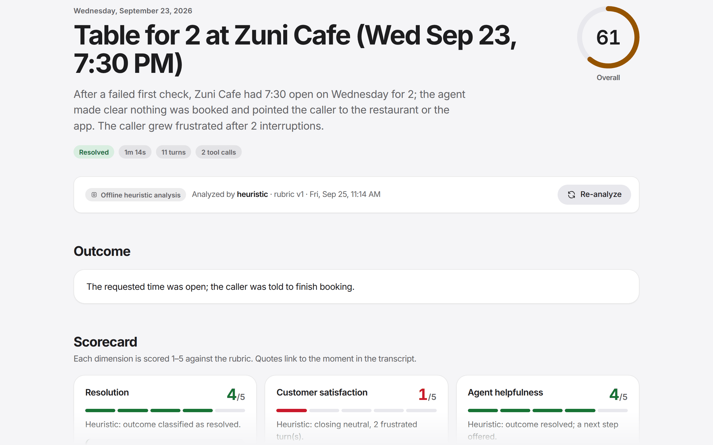
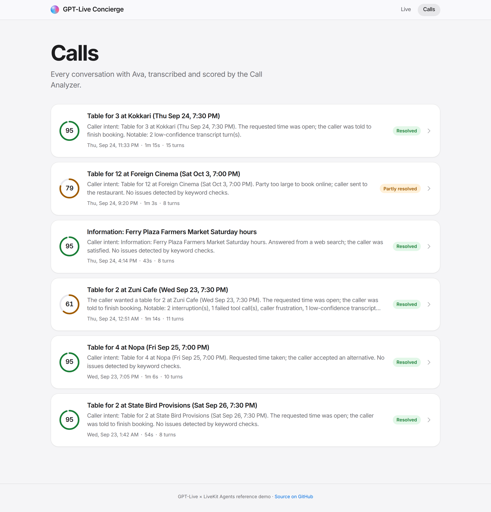
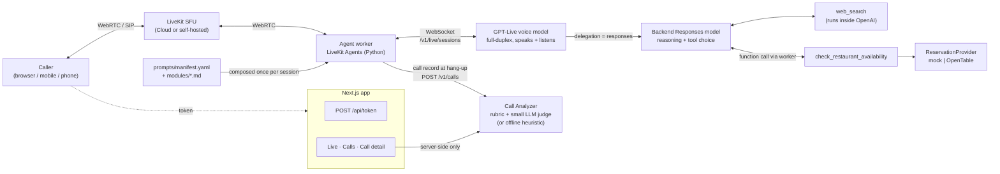
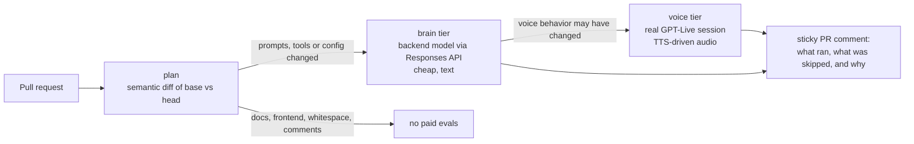

# GPT-Live × LiveKit: a reference voice agent

An end-to-end, production-shaped voice agent built on **OpenAI GPT-Live** (`gpt-live-1`) and
**LiveKit Agents**. It has a **modular prompt system**, two real tools (**web search** and
**restaurant availability**), a **change-aware eval system** that runs paid evals only when a
change could actually alter the agent's behavior, and **call recording** into a separate **Call
Analyzer** service that grades every finished call against a versioned rubric. A Next.js app
lets you talk to the agent, browse past calls, and read each call's scorecard and transcript.

It is meant to be read as much as run. Every component has a written reason for existing, its
benefits and drawbacks, and the alternatives we turned down, so you can lift the parts you want
into your own voice agent.

> **Status:** reference demo. Everything runs offline without keys (tests, prompt rendering, eval
> planning, dry runs, and the Call Analyzer with six graded demo calls). A live call needs your
> own LiveKit project and an OpenAI key with GPT-Live access. All keys in this repo are
> placeholders.

---

## What it looks like

A graded call: the overall score, the outcome, and nine rubric dimensions, each with a
rationale and quotes that link back into the transcript.

<p align="center">
  
</p>

Every call the agent handles lands in **Calls**, newest first, with the caller's intent, a
summary, the outcome and a score (light and dark follow your OS):

<p align="center">
  <picture>
    <source media="(prefers-color-scheme: dark)" srcset="docs/images/ui-calls-dark.png">
    
  </picture>
</p>

The transcript shows what the agent actually heard: per-turn speech-recognition confidence,
interruptions, and the tool calls in between.

<p align="center">
  
</p>

The **Live** view, where you talk to the agent, and the mobile layouts are in
[`docs/frontend.md`](docs/frontend.md).

---

## Why this exists

Voice agents used to be built as a relay race: detect speech, transcribe it, send the text to an
LLM, synthesize the reply, and hope the turn detector guessed right about when the caller had
finished. The result works, but it feels like talking to a walkie-talkie.

GPT-Live changes the shape of the problem. It is a **full-duplex** voice model: it listens and
speaks at the same time and decides turn-taking itself. It also **delegates** reasoning and tool
calls to a separate backend "brain" model. That is a real step forward for naturalness. It also
brings new constraints that shape everything around it:

- **The voice model's instructions are immutable once the session starts.** Your prompt has to be
  right before the call connects, which argues for composing it from versioned modules.
- **There are two brains, each with its own instructions.** The voice model needs to know how to
  *talk*; the backend model needs to know how to *decide and call tools*. Those are different
  prompts.
- **You can't evaluate it as plain text.** LiveKit refuses to run a duplex model in text
  simulation, and audio evals are slow and cost real money. You want to run them only when you
  have to.

This repo is one opinionated answer to each of those constraints.

---

## The architecture in one picture



1. The **browser** gets a token from the Next.js app and joins a LiveKit room over WebRTC.
2. LiveKit **dispatches** the `gpt-live-agent` worker into the room.
3. The worker **composes the prompts** for the session: voice instructions for GPT-Live, backend
   instructions for the brain, and the tool list, then fingerprints them.
4. **GPT-Live** holds the conversation. When the caller asks for something that needs thought or
   data, it hands the work to the **backend model**, which calls `web_search` (inside OpenAI) or
   `check_restaurant_availability` (in our worker). GPT-Live then speaks the result in its own words.
5. When the caller hangs up, the worker **records the call** (transcript, tool calls, timing,
   transcription confidence, prompt fingerprint) and posts it to the **Call Analyzer**, which
   grades it in the background. The **Calls** views read the result.

A full walkthrough of one call ("a table for four at Nopa, Friday at seven") lives in
[`docs/architecture.md`](docs/architecture.md#4-request-walkthrough-a-table-for-four-at-nopa-friday-at-seven).

---

## What we chose, and what it costs

| Decision | Why | Benefit | Drawback we accept |
|---|---|---|---|
| **GPT-Live (full-duplex S2S)** instead of an STT→LLM→TTS cascade | A dining concierge is a *conversation*: people think aloud, interrupt, and change their minds. | Natural overlap, barge-in and backchannels with no VAD, STT, TTS or turn-detector tuning. | Less control over exact wording and turn-taking; per-minute voice pricing plus backend tokens. |
| **GPT-Live** instead of half-duplex realtime (`gpt-realtime`) | Tool calls take seconds, and delegation lets the voice keep the caller company meanwhile. | Reasoning model and effort are chosen separately from the voice. | Voice instructions can't change mid-session; appends are capped at about 500 tokens. |
| **`responses` delegation** instead of `client` | Our tools are normal `@function_tool`s plus OpenAI's hosted web search. | LiveKit's tool machinery works unchanged; tools can change mid-session. | The backend model is OpenAI's; you don't orchestrate the reasoning loop yourself. |
| **LiveKit Agents** instead of a raw WebSocket or a hosted platform | Production voice needs WebRTC, dispatch, telephony and observability, not just a model socket. | Network resilience, worker load-balancing, SIP, client SDKs, first-class `DuplexModel` support. Open source and self-hostable. | Another piece of infrastructure to learn and run; the framework can lag brand-new provider features. |
| **Modular prompts composed per session** | Voice instructions are immutable after start, and two brains need two prompts. | Reviewable modules, strict validation, fingerprinted versions attached to every call. | One more layer of indirection than a string literal. |
| **Tool registry + provider abstraction** | Tools should be swappable and testable without a live call. | Deterministic mock for demos and evals; OpenTable (or Resy, SevenRooms…) behind one interface. | The OpenTable client is illustrative: its API is partner-gated. |
| **Three-tier, change-aware evals** | Audio evals are slow and costly, and most PRs don't change behavior. | Free unit tests always; cheap backend-brain evals when prompts or tools change; full voice evals only when voice behavior could change. | Voice evals rely on TTS-synthesized callers, which are cleaner than real audio. |
| **Post-call grading in a separate Call Analyzer** instead of inside the agent or a hosted QA product | Evals test changes; only real calls show how the agent does with real people. | The agent never waits on grading; every call gets a summary, nine anchored scores with verified quotes, and exact metrics; the rubric is versioned data; runs with zero keys. | A second service and a shared token to run; an LLM judge is a biased instrument that needs human calibration; transcripts are personal data whose retention is on you. |

Longer answers, with diagrams:

- [**Voice agent architectures**](docs/voice-agent-architectures.md): cascaded, half-duplex,
  full-duplex, hybrids, transports and hosting options, a decision matrix, and when **not** to use
  this design.
- [**Why LiveKit**](docs/why-livekit.md): what it gives you, what it costs, and the alternatives.
- [**GPT-Live primer**](docs/gpt-live-primer.md): duplex, delegation, append channels,
  capabilities, and how to use it in your own agent.

---

## Quickstart

**Prerequisites:** Python 3.10+, [uv](https://docs.astral.sh/uv/), Node 20+, a
[LiveKit Cloud](https://cloud.livekit.io) project (or `livekit-server --dev`), and an OpenAI API
key with GPT-Live access.

```bash
git clone <this repo> && cd gpt-live-demo
uv sync                                   # Python deps (agent + evals + dev tools)
cp .env.example .env                      # fill in LIVEKIT_* and OPENAI_API_KEY

# Free, offline, no keys:
uv run pytest -q                          # composer, tools, providers, eval planner
uv run python -m voice_agent.prompts render concierge     # see the exact prompts
uv run python -m evals run --tier brain --dry-run          # what an eval run would do + cost estimate

# Call Analyzer, in a second terminal (no keys: the offline heuristic grades the demo calls):
cd analyzer && uv sync && cp .env.example .env
uv run python -m call_analyzer seed       # load + grade the six calls in analyzer/demo/calls/
uv run python -m call_analyzer serve      # http://127.0.0.1:8080

# Talk to it (from the repo root):
uv run voice-agent console                # in your terminal, with your mic
# ...or run it as a worker and use the web client:
uv run voice-agent dev                    # (or: lk agent dev)
cd frontend && npm install && cp .env.example .env.local && npm run dev   # http://localhost:3000
```

To connect the pieces, set `CALL_ANALYZER_URL=http://localhost:8080` and the analyzer's
`CALL_ANALYZER_TOKEN` in **both** `.env` (so the agent posts calls) and `frontend/.env.local` (so
the Calls pages can read them). `frontend/.env.example` already has the local values; in `.env`
they're commented out, and without them the agent writes call records to `.call-records/`.

Step-by-step setup, deployment notes and troubleshooting are in
[`docs/getting-started.md`](docs/getting-started.md).

---

## Modular prompts

Prompts are **data, not code**. A manifest assembles small markdown modules into a *profile*, with
separate lists for the two brains:

```yaml
# prompts/manifest.yaml
profiles:
  concierge:
    voice:                       # -> GPT-Live voice instructions (immutable for the session)
      - core/identity
      - core/voice_style
      - core/guardrails
      - skills/restaurant_reservations.voice
      - skills/web_search.voice
    backend:                     # -> backend Responses model instructions
      - backend/tool_policy
      - skills/restaurant_reservations.backend
      - skills/web_search.backend
    tools: [web_search, check_restaurant_availability]
```

The composer is strict:
- Unknown variables, modules targeted at the wrong brain, and skills whose tools aren't enabled
  all fail in CI, not on a call.
- Runtime values such as `today` are injected at session start but left out of the fingerprint,
  so the fingerprint identifies the *prompt version*, not the day.
- Each call publishes its prompt fingerprint as LiveKit participant attributes, so any
  conversation can be traced back to the exact prompts that produced it.

→ [`docs/modular-prompts.md`](docs/modular-prompts.md)

## Tools

| Tool | Kind | Runs where | Notes |
|---|---|---|---|
| `web_search` | OpenAI provider tool (`WebSearch`) | Inside OpenAI, on the backend model | No search API key, no code of ours in the loop. |
| `check_restaurant_availability` | LiveKit `@function_tool` | In the agent worker | Validates arguments, **never books**, returns compact JSON the voice can speak. Backed by a deterministic mock or an OpenTable partner-API client. |

Adding your own tool takes one function, one registry entry, a voice module and a backend module,
one line in the manifest, a unit test, and an eval suite. The step-by-step tutorial is in
[`docs/tools.md`](docs/tools.md#10-tutorial-add-your-own-custom-tool).

## Evals that only run when they matter



The planner doesn't look at file paths. It renders the prompts and tool schemas for **both** the
base and head commits and compares *behavioral fingerprints*:

- **Voice prompt** wording changed → voice tier.
- **Backend prompt** or a model-visible **tool schema** changed → brain + voice.
- A tool's **implementation** changed → brain tier, and only for the suites that use that tool.
- Reflowed paragraphs, HTML comments, Python comments or formatting, docs or frontend only →
  **nothing runs**.

Evals themselves use deterministic assertions first, then an LLM judge, over multiple trials with
pass^k thresholds, under a hard cost budget. In GitHub Actions they run behind a protected
environment, are skipped on fork PRs, wait on draft PRs until they're ready for review, and can
be forced or skipped with the `evals:full` / `evals:skip` labels.

→ [`docs/evals.md`](docs/evals.md) · [`evals/README.md`](evals/README.md)

## Every call, graded

Evals run before you ship. The **Call Analyzer** ([`analyzer/`](analyzer)) looks at what
happened after: every real call, graded against the same versioned rubric.

- **Recording never hurts the call.** At hang-up the worker builds a `CallRecord` from the
  session history and posts it with a 5-second budget. If the analyzer is down or not
  configured, the record is written to `.call-records/` and can be ingested later.
- **Code computes, the model judges.** Metrics (talk ratio, interruptions, tool errors,
  transcription confidence) and the 0-100 overall score are computed in code. A small LLM judge
  (any OpenAI-compatible endpoint, `gpt-5.4-mini` by default) supplies the summary, intent,
  outcome and nine 1-5 scores. A policy violation or an invented fact caps the call at 40.
- **Evidence must be real.** Every quote the judge cites must appear in the turn it points to,
  or it's dropped. The transcript is fenced as untrusted data, because callers can say anything.
- **Zero keys needed.** Without an API key, a deterministic heuristic grades calls instead. It
  catches facts (a failed tool, an interruption, a frustrated caller), not meaning: it scores the
  demo call with an invented parking claim 95.

→ [`docs/call-analyzer.md`](docs/call-analyzer.md) · [`docs/frontend.md`](docs/frontend.md) ·
[`analyzer/README.md`](analyzer/README.md)

---

## Repository map

```
agent/voice_agent/        Python LiveKit worker
  main.py                   AgentServer entrypoint: compose prompts -> tools -> GPT-Live -> AgentSession
  model.py                  GPTLiveModel + backend (responses delegation) options
  agent.py                  VoiceAgent: instructions, tools, greeting
  config.py, runtime.py     settings (.env) and runtime prompt variables (today, timezone)
  prompts/                  PromptComposer, PromptBundle, CLI (`python -m voice_agent.prompts`)
  tools/                    registry, web_search, restaurants/ (mock + OpenTable providers)
  recording.py              CallRecord builder + exporter (analyzer, or .call-records/ fallback)
agent/tests/              unit tests (offline)
prompts/                  manifest.yaml + modules/**.md  (the prompt *data*)
evals/                    suites, brain/voice runners, judge, change-impact planner, tests
analyzer/                 Call Analyzer: separate uv project, Dockerfile, own tests
  call_analyzer/            FastAPI app, SQLite queue + worker, rubric.yaml, providers (LLM, heuristic)
  demo/calls/               six realistic CallRecords for a zero-key demo
frontend/                 Next.js app (App Router)
  app/                      / (Live), /calls, /calls/[id], /unlock, /api/token, Server Actions
  components/               live/ (room, orb, transcript), calls/ (list), call/ (scorecard, transcript)
  lib/                      server-only analyzer client, passcode gate, types mirroring the analyzer
docs/                     architecture, trade-offs, primer, prompts, tools, evals, analyzer, frontend
.github/workflows/        ci.yml (lint, tests, prompt render, analyzer, frontend) and evals.yml
```

## Documentation

| Doc | Read it for |
|---|---|
| [Getting started](docs/getting-started.md) | Running it locally, deploying, troubleshooting, and adopting GPT-Live in your own agent |
| [Architecture](docs/architecture.md) | Components, session lifecycle, a request walkthrough, module map, configuration |
| [Voice agent architectures](docs/voice-agent-architectures.md) | Every architecture we considered, with trade-offs and a decision matrix |
| [Why LiveKit](docs/why-livekit.md) | What the media and orchestration layer buys you, and what it costs |
| [GPT-Live primer](docs/gpt-live-primer.md) | How GPT-Live works and how to use it |
| [Modular prompts](docs/modular-prompts.md) | The prompt workflow: manifest, modules, fingerprints, writing guidance |
| [Tools](docs/tools.md) | Where tools run, the registry, providers, and an add-a-tool tutorial |
| [Evals](docs/evals.md) | Eval tiers, suites, change-impact detection, CI workflows, best practices |
| [Call Analyzer](docs/call-analyzer.md) | Post-call grading: rubric, LLM judge vs code, evidence checks, privacy, scaling, alternatives |
| [Frontend](docs/frontend.md) | The Live, Calls and Call detail views, the server/client boundary, the passcode gate |

## Configuration

All configuration is environment variables. See [`.env.example`](.env.example) (agent),
[`frontend/.env.example`](frontend/.env.example) (web client) and
[`analyzer/.env.example`](analyzer/.env.example) (Call Analyzer); the full reference is in
[`docs/architecture.md`](docs/architecture.md#7-configuration-reference) and
[`analyzer/README.md`](analyzer/README.md#configuration). The main settings:

| Variable | Default | Purpose |
|---|---|---|
| `GPT_LIVE_MODEL` / `GPT_LIVE_VOICE` | `gpt-live-1` / `marin` | Voice model and voice |
| `GPT_LIVE_BACKEND_MODEL` | `gpt-5.6-luna` | Backend model GPT-Live delegates to |
| `GPT_LIVE_BACKEND_REASONING_EFFORT` | `low` | Latency beats depth on a call |
| `AGENT_PROFILE` | `concierge` | Which profile in `prompts/manifest.yaml` to run |
| `RESTAURANT_PROVIDER` | `mock` | `mock` (deterministic) or `opentable` (partner credentials) |
| `LIVEKIT_AGENT_NAME` | `gpt-live-agent` | Explicit-dispatch name; the frontend requests the same one |
| `CALL_RECORDING_ENABLED` | `true` | Build and export a call record at the end of every session |
| `CALL_ANALYZER_URL` / `CALL_ANALYZER_TOKEN` | unset | Agent: where to post records (unset: write to `.call-records/`). Frontend: where the Calls pages read. Analyzer: the token it requires. Same token everywhere |
| `DEMO_PASSCODE` | unset | Frontend only: optional passcode gate for the token route and the Calls pages |

## Caveats

- **GPT-Live is a young API.** Model slugs, defaults and pricing (around $0.05 per voice-minute at
  the time of writing, plus backend tokens) may change. Check OpenAI's current documentation.
- **OpenTable's API is partner-gated.** The client shows the real integration concerns (OAuth2
  client credentials, token caching, timeouts, error mapping), but its endpoints and fields are
  placeholders to adapt once you have partner access. The mock provider is the default.
- **The evals and the Call Analyzer's LLM judge are tested offline but haven't been run against
  live models** in this repo. Expect to tune voice-runner timing, pricing estimates and the
  judge's token limits on the first real run.
- **Zero-key call grading is a smoke test.** Without an API key the analyzer uses a keyword and
  metrics heuristic, labeled as such in the UI. It can't tell a made-up fact from a real one.
- **Public deploys need a rate limit at the edge.** Every `POST /api/token` starts a paid
  GPT-Live session. `DEMO_PASSCODE` is a speed bump, not auth; put a rate limit in front of
  `/api/token` and `/unlock` at your host or proxy, and keep the analyzer on a private network.
- **CI actions still run on Node 20.** GitHub is retiring the Node 20 runtime for JavaScript
  actions. The workflows pin actions by SHA; bump them to their Node 24 majors (and re-pin)
  after the first real run.

## License

[MIT](LICENSE)
