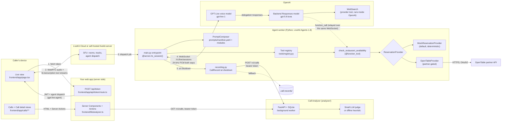
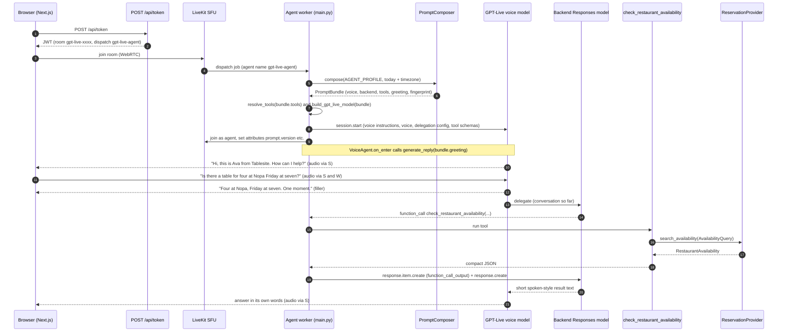
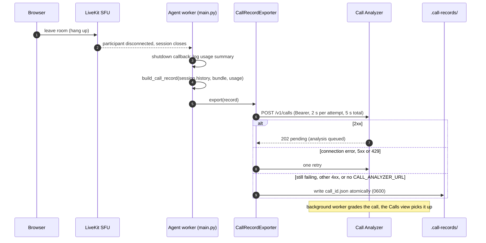
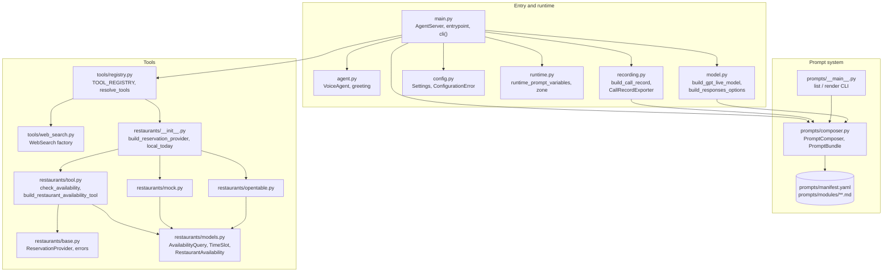
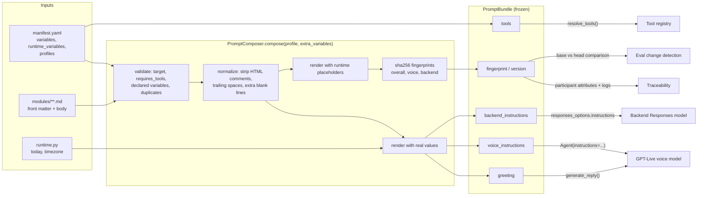

# Architecture: how this repo is put together

This is the system design of the reference agent in this repo: what each component is, why we
picked it, what it buys you, what it costs you, and how you would swap it for your own agent.
The survey of *other* designs lives in
[`voice-agent-architectures.md`](voice-agent-architectures.md); this page is about the one we
built.

> Related: [`gpt-live-primer.md`](gpt-live-primer.md) (the model),
> [`why-livekit.md`](why-livekit.md) (the transport and runtime),
> [`modular-prompts.md`](modular-prompts.md) (the prompt system),
> [`tools.md`](tools.md) (the tools and how to add yours), [`evals.md`](evals.md) (the eval
> system), [`call-analyzer.md`](call-analyzer.md) (post-call grading),
> [`frontend.md`](frontend.md) (the web app), [`getting-started.md`](getting-started.md) (run it).

---

## Contents

1. [The system on one page](#1-the-system-on-one-page)
2. [Components](#2-components)
3. [Session lifecycle](#3-session-lifecycle)
4. [Request walkthrough: "a table for four at Nopa, Friday at seven"](#4-request-walkthrough-a-table-for-four-at-nopa-friday-at-seven)
5. [Code module map](#5-code-module-map)
6. [Prompt composition data flow](#6-prompt-composition-data-flow)
7. [Configuration reference](#7-configuration-reference)
8. [Failure modes and where they show up](#8-failure-modes-and-where-they-show-up)
9. [Adapting this architecture](#9-adapting-this-architecture)

---

## 1. The system on one page



Four hops carry the call, each chosen deliberately:

| Hop | Protocol | Why this protocol |
|---|---|---|
| Browser → token route | HTTPS `POST` | The LiveKit API secret must never reach the browser. |
| Browser ↔ LiveKit | WebRTC (UDP, Opus) | The last mile is lossy Wi-Fi and cellular; WebRTC handles jitter and loss, a WebSocket stalls. See [`why-livekit.md`](why-livekit.md). |
| LiveKit ↔ worker | WebRTC | The worker joins the room as a participant, like any other client. |
| Worker ↔ OpenAI | WebSocket | Datacenter to datacenter, where TCP is fine. This is how the GPT-Live plugin connects. |

Two more happen outside the call: the worker posts the finished call record to the Call Analyzer
over HTTPS, and the web app's server reads it back to render the Calls pages. Neither is on the
latency path of a conversation.

The backend Responses model and the `WebSearch` tool never talk to the worker directly. Delegated
work runs inside OpenAI. The only thing that comes back to the worker is a `function_call` for a
tool that *we* implement, and it arrives over the same GPT-Live WebSocket.

---

## 2. Components

Each component gets the same five questions: **role**, **why we chose it**, **benefit**,
**drawback**, and **how to swap it**.

### 2.1 Browser client (`frontend/`)

- **Role.** A Next.js (App Router) app with three views. **Live** fetches a token, joins the
  room with `<LiveKitRoom>`, plays the agent's audio, shows the agent state
  (`useVoiceAssistant`), and renders a live transcript from `useTranscriptions()`. **Calls** and
  **Call detail** are Server Components that read the Call Analyzer server-side and render the
  history, scorecards and recorded transcripts. Details in [`frontend.md`](frontend.md).
- **Why.** The smallest UI that shows everything a voice agent needs (connect, mic, visualizer,
  transcript, hang up) plus what happened afterwards. LiveKit's React components do the WebRTC
  work; the analyzer token never leaves the server.
- **Benefit.** You can read the whole client in an afternoon. No UI or chart libraries. The
  agent itself is not browser-specific.
- **Drawback.** It's a demo UI. Access control is an optional shared passcode
  (`DEMO_PASSCODE`), not user accounts; there's no rate limiting in the app (you need one at the
  edge before a public deploy); and reconnection UX is whatever the components do by default.
- **Swap it.** Any LiveKit client SDK (Swift, Kotlin, Flutter, React Native, Unity) works against
  the same agent. LiveKit's hosted [Agents Playground](https://agents-playground.livekit.io) also
  works and needs no code. For phone calls, put LiveKit SIP in front of the same rooms.

### 2.2 Token route (`frontend/app/api/token/route.ts`)

- **Role.** `POST /api/token` mints a 15-minute LiveKit JWT for a fresh random room
  (`gpt-live-<8 hex>`) and identity (`user-<8 hex>`). The grant is least-privilege: join that
  room, publish the microphone only (no camera, screen or data messages), and subscribe. If
  `LIVEKIT_AGENT_NAME` is set, the token
  carries a `RoomConfiguration` with a `RoomAgentDispatch` for that agent name. The agent joins
  as soon as the room is created.
- **Why.** Explicit dispatch means only rooms that ask for `gpt-live-agent` get this worker. That
  matters once one LiveKit project hosts more than one agent.
- **Benefit.** Secrets stay server-side. Every browser session gets its own room and its own
  agent job.
- **Drawback.** Every token starts a paid GPT-Live session. Without `DEMO_PASSCODE`, anyone
  who can reach the route gets one (fine on localhost). With it, the route returns 401 until
  the visitor has the unlock cookie, but a passcode is shared, and a fixed delay on wrong guesses
  doesn't stop parallel requests. Put real auth, or at least a rate limit at your host or proxy,
  in front of it before you ship ([`frontend.md`](frontend.md#demo_passcode-and-why-it-isnt-enough)).
- **Swap it.** Put the same ~20 lines in any backend (FastAPI, Express, Go) with the matching
  LiveKit server SDK. To use automatic dispatch instead, leave `LIVEKIT_AGENT_NAME` empty on
  *both* sides (see [7](#7-configuration-reference)).

### 2.3 LiveKit server (SFU)

- **Role.** Routes media between the caller and the agent, and dispatches agent jobs to
  registered workers.
- **Why.** WebRTC on the user leg, worker dispatch and load balancing, telephony, and
  first-class support for GPT-Live as a `DuplexModel`. The full argument is in
  [`why-livekit.md`](why-livekit.md).
- **Benefit.** Production transport from day one. LiveKit Cloud and a self-hosted
  `livekit-server` differ only in URL and credentials.
- **Drawback.** One more piece of infrastructure (or one more vendor), and one extra media hop.
- **Swap it.** For a phone-only product on an existing CPaaS, or a single-user prototype, see the
  alternatives table in [`why-livekit.md`](why-livekit.md#alternatives). The agent's prompt,
  tool, and provider layers have no LiveKit transport dependency; only `main.py` and `agent.py`
  do.

### 2.4 Agent worker (`agent/voice_agent/main.py`)

- **Role.** A LiveKit Agents `AgentServer` whose `@server.rtc_session()` entrypoint runs once per
  room. It registers under the agent name from `LIVEKIT_AGENT_NAME` (`main.py` sets
  `gpt-live-agent` as the default). Per session it does five things:
  1. composes the prompt bundle, with runtime variables for today's date and timezone;
  2. resolves the profile's tools through the registry;
  3. builds the `GPTLiveModel`;
  4. starts `AgentSession(llm=model)` with a `VoiceAgent`;
  5. publishes the prompt fingerprint as participant attributes and logs usage;
  6. at shutdown, builds a call record and exports it ([2.12](#212-call-recording-agentvoice_agentrecordingpy)).

  Before any of that, at **worker startup**, `ValidatingAgentServer.run` calls `preflight()`:
  it loads `Settings`, composes the configured profile, resolves its tools, requires
  `OPENAI_API_KEY`, and (if recording is on) validates the analyzer settings. A failure exits
  with one line, `voice-agent: invalid configuration, not starting: <reason>`, *before* the
  worker registers with LiveKit, so a misconfigured worker never accepts a job and leaves a
  caller in a silent room. `run` is used rather than LiveKit's `setup_fnc` (prewarm) because
  prewarm runs in each job subprocess after registration.
- **Why.** The framework gives us process-per-job isolation, dispatch, graceful drain, the
  `console` / `dev` / `start` dev loop, and the `DuplexRealtimeAdapter` that lets GPT-Live stand
  in for "the LLM" in an `AgentSession`.
- **Benefit.** The entrypoint is short. There is no VAD, STT, TTS, or turn detector to
  configure, because GPT-Live does all of that. Configuration mistakes fail at deploy time, not
  on the first call.
- **Drawback.** You take on LiveKit's lifecycle concepts (jobs, rooms, participants). The
  built-in Python CLI (`uv run voice-agent ...`) is deprecated in 1.8 in favor of
  `lk agent ...`. Both work today.
- **Swap it.** To add a stage (say, an authenticated "account" agent after triage), add an
  `Agent` subclass and hand off to it. Remember that with GPT-Live a handoff that changes
  instructions opens a *new* voice session, seeded from history
  ([primer §4](gpt-live-primer.md#4-capabilities-what-can-change-after-start)).

### 2.5 GPT-Live voice model (`agent/voice_agent/model.py`)

- **Role.** The voice brain. It listens and speaks at the same time, owns turn-taking, and
  transcribes the caller. Its instructions are the bundle's `voice_instructions`, passed through
  `Agent(instructions=...)`. The voice defaults to `marin`.
- **Why.** A dining concierge is a conversation. People hesitate, correct themselves, and talk
  over the agent. A full-duplex model handles that natively, and it keeps talking ("one moment,
  let me check") while the backend runs a tool.
- **Benefit.** The most natural conversational feel available off the shelf, with the least
  plumbing.
- **Drawback.** Its instructions are **immutable after session start**. There is no text hook
  before speech, and no client-side cancel or truncate. It is per-minute billing on top of
  backend tokens, and it ties you to OpenAI (or Azure OpenAI) for the voice. The honest list is
  in [`voice-agent-architectures.md` §8](voice-agent-architectures.md#drawbacks-we-accept-and-how-we-mitigate-them).
- **Swap it.** Change `GPT_LIVE_VOICE` / `GPT_LIVE_MODEL` for a different voice or model slug.
  For Azure, replace the constructor in `build_gpt_live_model` with `GPTLiveModel.with_azure(...)`
  ([primer §5](gpt-live-primer.md#azure-openai)). To leave GPT-Live entirely, pass a different
  `llm=` (or `stt=`/`llm=`/`tts=`) to `AgentSession`. The prompt, tool, and provider layers carry
  over unchanged, though you would merge the voice and backend prompts into one.

### 2.6 Backend Responses model (`build_responses_options`)

- **Role.** The reasoning brain. With `delegation="responses"`, GPT-Live hands it the
  conversation whenever it needs to think or act. It sees the bundle's `backend_instructions` and
  the tool schemas. It decides which tool to call and with which arguments, and it writes the
  short text that the voice model then says in its own words.
- **Why.** Decoupling reasoning from voice lets us choose the model and effort independently.
  The defaults are `gpt-5.6-luna` with `reasoning.effort=low`, `text.verbosity=low`, and
  `parallel_tool_calls=True`.
- **Benefit.** Tool calling is plain Responses API behavior. It is also the one brain we can
  evaluate cheaply as text (the `brain` eval tier reuses `build_responses_options`).
- **Drawback.** It adds a second meter (tokens plus tool fees) and a second prompt to maintain.
  It never hears audio, so it only knows what the voice model passed along.
- **Swap it.** Set `GPT_LIVE_BACKEND_MODEL`, `GPT_LIVE_BACKEND_REASONING_EFFORT`,
  `GPT_LIVE_BACKEND_VERBOSITY`, and `GPT_LIVE_BACKEND_MAX_OUTPUT_TOKENS`. To use a brain that is
  not an OpenAI Responses model (your own orchestrator, another vendor), switch to
  `delegation="client"`. That mode does not allow framework tools at all
  ([`tools.md` §9](tools.md#9-alternative-client-delegation)).

### 2.7 Prompt system (`agent/voice_agent/prompts/`, `prompts/`)

- **Role.** Turns `prompts/manifest.yaml` plus markdown modules into a frozen `PromptBundle`:
  voice instructions, backend instructions, a tool list, an optional greeting, and a
  fingerprint.
- **Why.** GPT-Live voice instructions can't change mid-session, so the full prompt has to be
  right *before* connecting. It also has to be reviewable, testable, and versioned.
- **Benefit.** Small, reviewed modules; strict validation at composition time; one fingerprint
  that ties every transcript to a prompt version and tells CI which evals to run.
- **Drawback.** It adds a manifest and a composer that a single f-string doesn't need. Variables
  are plain `{{ name }}` substitution with no logic.
- **Swap it.** See [`modular-prompts.md`](modular-prompts.md). The only contract the rest of the
  code relies on is `PromptBundle`.

### 2.8 Tool registry (`agent/voice_agent/tools/registry.py`)

- **Role.** Maps tool *names* in the manifest to factories `(Settings) -> list[llm.Tool]`.
  `resolve_tools(bundle.tools, settings)` builds fresh tool objects for each session.
- **Why.** Prompts and tools must agree. The composer refuses a skill module whose
  `requires_tools` aren't enabled, and the registry refuses an unknown tool name. Each spec's
  `source_modules` also tells the eval change detector which code belongs to which tool.
- **Benefit.** Adding a tool touches a known set of files. A typo fails at session start, never
  silently.
- **Drawback.** One level of indirection over `Agent(tools=[...])`. Tools, and the provider
  behind them, are built per session, so provider state such as the OpenTable OAuth token lives
  for one call. That is deliberate: LiveKit may run jobs on separate event loops, and asyncio
  primitives can't be shared across them (see [`tools.md`](tools.md#6-the-provider-abstraction)).
- **Swap it.** See [`tools.md`](tools.md).

### 2.9 Web search (`agent/voice_agent/tools/web_search.py`)

- **Role.** `WebSearch(search_context_size=...)`, an OpenAI *provider tool* that runs entirely
  inside OpenAI on the backend model.
- **Why.** No search API key, no code of ours in the loop, and results don't round-trip through
  the worker.
- **Benefit.** Zero latency added by the worker and zero code to maintain.
- **Drawback.** It only works where the brain is an OpenAI Responses model. There is little
  control over sources, and search fees are billed separately. It is also not deterministic,
  so its evals judge behavior, not facts.
- **Swap it.** Replace it with a `@function_tool` that calls your own search or RAG service
  ([`tools.md` §4](tools.md#4-tool-1-web_search-provider-tool)).

### 2.10 Restaurant availability tool and providers (`agent/voice_agent/tools/restaurants/`)

- **Role.** `check_restaurant_availability(restaurant, date, time, party_size, city=None)` is a
  function tool that runs in the worker. It validates arguments, calls a `ReservationProvider`,
  and returns compact JSON. It **never books**.
- **Why.** Real-world tools have to deal with validation, vendor APIs, auth, timeouts, and
  friendly errors. This tool shows all of that behind a provider-neutral interface.
- **Benefit.** The deterministic mock is the default, so the demo and the evals work with zero
  partner credentials. OpenTable (or any vendor) plugs in behind the same `Protocol`.
- **Drawback.** The OpenTable API is partner-gated. The endpoints in `opentable.py` are
  **illustrative placeholders**; the OAuth, caching, retry, timeout, and error mapping are real.
- **Swap it.** Implement `ReservationProvider.search_availability` for Resy, SevenRooms, Yelp, or
  your own system, then add it to `build_reservation_provider`
  ([`tools.md` §6](tools.md#6-the-provider-abstraction)).

### 2.11 Configuration and observability (`config.py`, `runtime.py`, `main.py`)

- **Role.** `Settings` (pydantic-settings) reads `.env` and the environment. Secrets are
  `SecretStr` and optional, so imports, tests, and evals never need keys. `runtime.py` computes
  `today` (for example `Friday, 2026-09-25`) and `timezone` in `AGENT_TIMEZONE`. `main.py`
  handles the observability side:
  - it tags every log line from the job with `profile` and `prompt_fingerprint`;
  - it logs the composed modules and the per-target fingerprints;
  - it logs usage as it accrues and as a summary at shutdown;
  - it publishes `prompt.*` participant attributes.
- **Why.** Missing keys and invalid settings (an unknown `AGENT_TIMEZONE`, an analyzer URL
  without a token) should fail when the worker starts, with an actionable message, not at
  import and not on a call. Any transcript should be traceable to the exact prompt that
  produced it.
- **Benefit.** Tests and CI run without secrets. A support ticket that includes the room's
  `prompt.version` tells you precisely which prompt the caller heard.
- **Drawback.** There are no metrics or tracing exporters wired up. It's logs only (plus the
  per-call record in the Call Analyzer).
- **Swap it.** LiveKit Agents emits OpenTelemetry traces and `metrics_collected` events
  ([`why-livekit.md`](why-livekit.md#7-framework-features-we-actually-use)). Hook your
  observability stack there.

### 2.12 Call recording (`agent/voice_agent/recording.py`)

- **Role.** A job shutdown callback turns `session.history` into a **CallRecord v1**: turns
  with timestamps, interruption flags and transcription confidence, tool calls paired with
  their outputs, the prompt fingerprints, models and usage. `CallRecordExporter` posts it to
  `CALL_ANALYZER_URL/v1/calls`, or writes `.call-records/<call_id>.json` when no analyzer is
  configured or it doesn't take the record.
- **Why.** Evals cover changes; real calls need their own record to be graded. The job's
  shutdown is the one moment the full history (including a final interrupted turn) is
  available and the caller is already gone.
- **Benefit.** Recording can't hurt the call: it runs after the caller has left, is bounded to
  5 s (one retry on connection errors, 5xx and 429), never raises, and falls back to an atomic
  `0600` file so a transcript isn't lost to an outage. The builder enforces the analyzer's limits
  up front, so records aren't bounced.
- **Drawback.** Text only, no audio. A worker killed hard (OOM, `SIGKILL`) skips shutdown
  callbacks and loses that call's record. Fallback files are transcripts on the worker's disk:
  somebody has to ship and delete them.
- **Swap it.** Point `CALL_ANALYZER_URL` at anything that accepts CallRecord v1, or change the
  exporter to publish to a queue. `CALL_RECORDING_ENABLED=false` turns it off. LiveKit Cloud's own
  session recording (`AgentSession.start(record=...)`) is the managed alternative
  ([`call-analyzer.md` §13](call-analyzer.md#13-alternatives-we-considered)).

### 2.13 Call Analyzer (`analyzer/`)

- **Role.** A separate FastAPI service with its own lockfile and Docker image. It stores call
  records in SQLite, grades each one in a bounded background worker (a small LLM judge on any
  OpenAI-compatible endpoint, or an offline heuristic), and serves `GET /v1/calls` and
  `GET /v1/calls/{id}` to the web app.
- **Why.** Grading takes seconds and retries for hours; it doesn't belong in a voice worker. The
  analyzer is the one place that holds transcripts and the judge's key.
- **Benefit.** Every call gets a summary, an outcome, nine anchored 1-5 scores with verified
  evidence quotes, exact metrics, and a code-computed 0-100 score. The rubric is versioned data,
  and re-grading is one API call.
- **Drawback.** A second service, a shared bearer token, and a wire contract to keep in sync.
  SQLite means one process. The judge is a biased instrument that needs human calibration.
- **Swap it.** Change the judge with `ANALYZER_BASE_URL` / `ANALYZER_MODEL`, the criteria in
  `rubric.yaml`, the storage by implementing the repository `Protocol` on Postgres. The full
  design, alternatives and adaptation guide are in [`call-analyzer.md`](call-analyzer.md).

---

## 3. Session lifecycle

From "caller clicks Start" to the first spoken result. Solid arrows are requests, dashed arrows
are responses or events.



Four points about this flow:

- **Steps 5–8 happen once.** The voice instructions sent in `session.start` can't change later
  (`mutable_instructions=False`). That is the whole reason the prompt system composes up front.
- **The greeting is a request, not a script.** `generate_reply(instructions=...)` becomes a
  one-off commentary ask; the model phrases it. `session.say()` is unsupported on a duplex model.
- **The filler (step 14) comes from the voice model itself**, prompted by `core/voice_style`.
  No code of ours plays it.
- **User transcripts come from GPT-Live** and are published on the `lk.transcription` text
  stream, together with the agent's own transcript. No STT is involved.

### At hang-up



The job closes the `AgentSession` before it runs shutdown callbacks, so the history is complete,
including a last turn the caller interrupted. A session that never produced a conversation turn
is not recorded.

---

## 4. Request walkthrough: "a table for four at Nopa, Friday at seven"

One call, traced through the real code with the real mock data. Assume the call happens on
**Wednesday, 23 September 2026**, with `AGENT_TIMEZONE=America/Los_Angeles` and the default
`RESTAURANT_PROVIDER=mock`.

**1. Session start.** `compose_session_prompts()` renders the `concierge` profile. The runtime
variables are `today="Wednesday, 2026-09-23"` and `timezone="America/Los_Angeles"`. Both
prompts now say *"Today is Wednesday, 2026-09-23"*. The fingerprint still reads
`3a38d1b337b0`, because runtime variables are replaced by `<runtime:...>` placeholders before
hashing. The worker logs `composed prompts` with that fingerprint and sets the attributes
`prompt.version=3a38d1b337b0`, `prompt.voice=156db23431d2`, `prompt.backend=e3ad63e9c465`, and
`prompt.tools=web_search,check_restaurant_availability`.

**2. Greeting.** `VoiceAgent.on_enter` asks for the profile greeting: *"Greet the caller warmly
in one short sentence as Ava from Tablesite, then ask how you can help. Do not list your
capabilities."* Ava says something like *"Hi, this is Ava with Tablesite. What can I do for
you?"*

**3. The caller asks.** *"Hey, can I get a table for four at Nopa on Friday at seven?"* GPT-Live
transcribes it itself. `core/voice_style` tells it to confirm details and cover the wait, so it
says *"Four people at Nopa, Friday at seven. Let me check."* and delegates to the backend.

**4. The backend resolves and calls.** `backend/tool_policy` says to convert relative dates using
today's date, treat a bare dinner hour as evening, and only call a tool once all required
arguments are known. `skills/restaurant_reservations.backend` lists the arguments. The backend
emits:

```json
{"restaurant": "Nopa", "date": "2026-09-25", "time": "19:00", "party_size": 4}
```

`city` is omitted because the caller didn't mention one; the backend prompt says the default
area is San Francisco.

**5. The worker runs the tool.** The call arrives on the GPT-Live WebSocket. LiveKit invokes
`check_restaurant_availability`, which calls `check_availability(...)`:

- `today` comes from `local_today("America/Los_Angeles")`, which gives 2026-09-23.
- `_parse_date("2026-09-25")` passes: not in the past, and within 180 days.
- `_parse_time("19:00")` passes.
- The arguments are wrapped in an `AvailabilityQuery`, and the provider is called.

The mock seeds a PRNG from `sha256("v1|nopa|2026-09-25")`. It draws which slots are open
between 17:00 and 21:45, keeps the ones within ±90 minutes of 19:00, and finds 19:00 itself
taken. The tool returns (this is real output):

```json
{"restaurant":"Nopa","date":"2026-09-25","weekday":"Friday","requested_time":"19:00","party_size":4,"status":"alternatives","requested_time_available":false,"nearest_available_times":["18:45","19:15","18:30"],"booking":"not booked - availability check only"}
```

**6. The result goes back.** The plugin sends it as a `function_call_output`
(`response.item.create`), then `response.create`. The backend follows
`skills/restaurant_reservations.backend` ("offer at most three nearby times, closest first";
"never state or imply that a table has been reserved") and `backend/tool_policy` ("one to three
short, plain sentences … no ISO formats"). It writes something like: *"Seven isn't open on
Friday, September 25th, but 6:45, 7:15, and 6:30 pm are. Ask which works; booking is done with
the restaurant or in the app."*

**7. The voice speaks.** GPT-Live says it in its own words, guided by
`skills/restaurant_reservations.voice` ("offer the two or three closest alternatives and ask
which works"): *"Seven's taken on Friday, but I've got six forty-five or seven fifteen. Would
either of those work?"* If the caller picks one, the guardrails module makes sure Ava says the
time *looks open* and points them to the restaurant or the Tablesite app. She never says it's
booked.

**What each layer contributed:**

| Concern | Handled by |
|---|---|
| Hearing "for four" over background noise, knowing the caller finished | GPT-Live voice model |
| "Let me check" while the lookup runs | `core/voice_style` (voice prompt) |
| "Friday" → `2026-09-25`, "seven" → `19:00` | Backend model + `backend/tool_policy` + runtime `today` |
| Refusing a past date or `"7pm"` | `check_availability` validation → `ToolError` the model can act on |
| Deterministic slots for evals | `MockReservationProvider` seeded by restaurant + date |
| Not claiming a booking | Tool output field `"booking"`, backend skill module, `core/guardrails` |
| Tracing this call to the prompt | `prompt.version=3a38d1b337b0` attribute and log context |

The same flow with `RESTAURANT_PROVIDER=opentable` differs only inside step 5. The provider
fetches (or reuses) an OAuth token, resolves "Nopa" to a restaurant id, and fetches slots with a
6 s timeout. Any failure becomes a `ToolError` with a caller-friendly message.

---

## 5. Code module map



| File | Responsibility | Depends on LiveKit? |
|---|---|---|
| `agent/voice_agent/main.py` | `ValidatingAgentServer` with startup `preflight()`, per-session entrypoint, default agent name, trace attributes, usage logging, the shutdown callback that records the call, `cli()` console script. | Yes |
| `agent/voice_agent/agent.py` | `VoiceAgent(Agent)`: voice instructions and tools from the bundle; greets in `on_enter`. | Yes |
| `agent/voice_agent/model.py` | `GPTLiveModel` with `delegation="responses"`; `build_responses_options` (reused by evals). | Yes (plugin) |
| `agent/voice_agent/config.py` | `Settings` from env/`.env` (validated: timezone, analyzer URL); `require_openai_api_key()`, `call_analyzer_endpoint()`. | No |
| `agent/voice_agent/recording.py` | `build_call_record` (history → CallRecord v1, limits enforced), `CallRecordExporter` (POST with retry, file fallback). | Types only (`llm.ChatItem`) |
| `agent/voice_agent/runtime.py` | `today` / `timezone` prompt variables; IANA zone with UTC fallback. | No |
| `agent/voice_agent/prompts/composer.py` | Manifest and module parsing, strict rendering, fingerprints, `trace_attributes()`. | No |
| `agent/voice_agent/prompts/__main__.py` | `python -m voice_agent.prompts list|render`. | No |
| `agent/voice_agent/tools/registry.py` | `ToolSpec`, `TOOL_REGISTRY`, `resolve_tools`, `UnknownToolError`. | Types only |
| `agent/voice_agent/tools/web_search.py` | `WebSearch(search_context_size=...)` factory. | Yes (plugin) |
| `agent/voice_agent/tools/restaurants/tool.py` | Argument validation, `ToolError` mapping, `@function_tool` factory. | Yes (`function_tool`, `ToolError`) |
| `agent/voice_agent/tools/restaurants/base.py` | `ReservationProvider` Protocol; `ReservationError` family with caller-safe `user_message`. | No |
| `agent/voice_agent/tools/restaurants/models.py` | Provider-neutral pydantic models; `to_tool_output()` compact payload. | No |
| `agent/voice_agent/tools/restaurants/mock.py` | Deterministic fake availability. | No |
| `agent/voice_agent/tools/restaurants/opentable.py` | OAuth2 client credentials, token cache, 401 refresh, timeouts, error mapping; placeholder endpoints. | No (httpx) |
| `agent/voice_agent/tools/restaurants/__init__.py` | `build_reservation_provider(settings)`, `local_today(tz)`. | No |
| `prompts/manifest.yaml`, `prompts/modules/**` | Prompt *data*: profiles, variables, modules. | No |
| `agent/tests/` | Unit tests: no network, no keys (`uv run pytest`). | Partly |
| `frontend/` | Next.js app: Live, Calls and Call detail views, token route, passcode gate. | Client SDK |
| `analyzer/` | Call Analyzer service (separate project; see [`call-analyzer.md`](call-analyzer.md)). | No |

The LiveKit-free core (prompts, providers, models, validation) is the part you are most likely to
lift into another codebase.

---

## 6. Prompt composition data flow



The design and its trade-offs are covered in [`modular-prompts.md`](modular-prompts.md).

---

## 7. Configuration reference

All agent settings are read from the environment and from `.env` in the working directory
(`config.py`). Names are case-insensitive. Secrets are optional at import time and required only
when a session actually needs them.

| Variable | Default | Used by | Notes |
|---|---|---|---|
| `LIVEKIT_URL` | none | LiveKit Agents worker | `wss://<project>.livekit.cloud` or `ws://localhost:7880` for `livekit-server --dev`. Not needed for `console`. |
| `LIVEKIT_API_KEY` / `LIVEKIT_API_SECRET` | none | LiveKit Agents worker | `livekit-server --dev` uses `devkey` / `secret`. |
| `LIVEKIT_AGENT_NAME` | `gpt-live-agent` (set by `main.py` if unset) | LiveKit Agents | Enables explicit dispatch. Set it to an **empty** value for automatic dispatch into every room. Must match the frontend's value. |
| `OPENAI_API_KEY` | none | `model.py` | Needs GPT-Live access. If missing, the worker refuses to start (`preflight`). |
| `GPT_LIVE_MODEL` | `gpt-live-1` | `model.py` | Voice model slug. |
| `GPT_LIVE_VOICE` | `marin` | `model.py` | `aster`, `beacon`, `cinder`, `marin`, `stone`, `vesper`. |
| `GPT_LIVE_BACKEND_MODEL` | `gpt-5.6-luna` | `model.py` | Backend Responses model. |
| `GPT_LIVE_BACKEND_REASONING_EFFORT` | `low` | `model.py` | `minimal`, `low`, `medium`, `high`. |
| `GPT_LIVE_BACKEND_VERBOSITY` | `low` | `model.py` | `low`, `medium`, `high`. Short backend answers keep spoken replies short. |
| `GPT_LIVE_BACKEND_MAX_OUTPUT_TOKENS` | unset | `model.py` | Integer ≥ 16. Unset means the service default. |
| `AGENT_PROFILE` | `concierge` | `main.py` | Profile in `prompts/manifest.yaml`. |
| `AGENT_TIMEZONE` | `America/Los_Angeles` | `runtime.py`, restaurant tool | IANA name. An unknown name is a settings error, so the worker refuses to start. |
| `PROMPTS_DIR` | repo `prompts/` | `composer.py` | Read at import time. Set it when the code is installed somewhere other than a repo checkout (e.g. a container image). |
| `WEB_SEARCH_CONTEXT_SIZE` | `low` | `web_search.py` | `low`, `medium`, `high`. More context costs more and is slower. |
| `RESTAURANT_PROVIDER` | `mock` | `restaurants/__init__.py` | `mock` or `opentable`. |
| `OPENTABLE_CLIENT_ID` / `OPENTABLE_CLIENT_SECRET` | none | OpenTable provider | Required when the provider is `opentable`. Partner credentials. |
| `OPENTABLE_API_BASE_URL` | `https://platform.opentable.com` | OpenTable provider | Placeholder; use the URL from your partner docs. |
| `OPENTABLE_OAUTH_URL` | `https://oauth.opentable.com/api/v2/oauth/token` | OpenTable provider | Placeholder; use the URL from your partner docs. |
| `OPENTABLE_TIMEOUT_SECONDS` | `6.0` | OpenTable provider | Per request, > 0. Connect timeout is `min(timeout, 3 s)`. |
| `CALL_RECORDING_ENABLED` | `true` | `main.py`, `recording.py` | Build and export a call record at the end of each session. |
| `CALL_ANALYZER_URL` | unset | `recording.py` | `http://` or `https://` base URL of the Call Analyzer. Unset: records go to `CALL_RECORDS_DIR`. |
| `CALL_ANALYZER_TOKEN` | unset | `recording.py` | The analyzer's shared bearer token. Required when `CALL_ANALYZER_URL` is set; otherwise the worker refuses to start. |
| `CALL_RECORDS_DIR` | `.call-records` | `recording.py` | Fallback directory (relative to the worker's working directory). Files contain transcripts; gitignored. |
| `LOG_LEVEL` | `INFO` | `main.py` | Level of the `voice_agent` logger. |

The frontend has its own file, `frontend/.env.local`, copied from `frontend/.env.example`. All
of it is read server-side only:

| Variable | Notes |
|---|---|
| `LIVEKIT_URL`, `LIVEKIT_API_KEY`, `LIVEKIT_API_SECRET` | Same LiveKit project as the agent. Read only by the token route. |
| `LIVEKIT_AGENT_NAME` | Set to `gpt-live-agent` to match the agent's default. If it is empty here while the agent uses its default name, the room gets **no agent**. |
| `CALL_ANALYZER_URL`, `CALL_ANALYZER_TOKEN` | Where the Calls pages read from, and the same token as the analyzer. |
| `DEMO_PASSCODE` | Optional. When set, the token route, the Calls pages and every Server Action require an unlock cookie ([`frontend.md`](frontend.md#demo_passcode-and-why-it-isnt-enough)). |

The Call Analyzer reads `analyzer/.env` (from [`analyzer/.env.example`](../analyzer/.env.example)):
`CALL_ANALYZER_TOKEN` (required for `serve`, at least 16 characters), the judge settings
(`ANALYZER_PROVIDER`, `ANALYZER_MODEL`, `ANALYZER_BASE_URL`, `ANALYZER_API_KEY` falling back to
`OPENAI_API_KEY`), storage and worker limits. The full table is in
[`analyzer/README.md`](../analyzer/README.md#configuration).

---

## 8. Failure modes and where they show up

| Failure | What happens | Where you see it |
|---|---|---|
| Invalid manifest or module (unknown variable, wrong target, missing tool) | `PromptCompositionError` at composition | Unit tests and the `render` CLI in CI. In production, the job fails at start. |
| Unknown tool name in a profile | `UnknownToolError` in `resolve_tools` | Session start. `test_every_profile_composes` catches it in CI. |
| `OPENAI_API_KEY` missing, unknown `AGENT_TIMEZONE`, or `CALL_ANALYZER_URL` without a token | `preflight()` fails in `ValidatingAgentServer.run` | The worker exits at startup with `voice-agent: invalid configuration, not starting: …` and never registers. |
| `RESTAURANT_PROVIDER=opentable` without credentials | `ConfigurationError` in `resolve_tools`, called by `preflight()` | The worker exits at startup with the message. |
| Model passes a bad date/time/party size | `ToolError` with a corrective message; the backend may retry once | Worker log warning; the caller hears a clarifying question. |
| Provider timeout, 429, 5xx, bad OAuth | `ReservationError` → `ToolError(user_message)` | Worker log (`reservation provider error` with `detail`); the caller hears "try again or call the restaurant". |
| Unexpected exception in a provider | Logged with traceback; generic `ToolError` | Worker log. The caller never hears internals. |
| GPT-Live connection drop | The plugin reconnects and reseeds from history (capped) | `session_reconnected`; see [primer §5](gpt-live-primer.md#reconnects-and-session-recycling). |
| Frontend and agent disagree on dispatch | The room has no agent | Browser stuck on "Waiting for agent…" See [`getting-started.md`](getting-started.md#troubleshooting). |
| Call Analyzer down, slow, or rejecting the record | One retry within a 5 s budget, then the record is written to `CALL_RECORDS_DIR` | Worker log `call record exported` at WARNING with the file path and reason. Ingest later with `call_analyzer seed --dir`. The caller notices nothing. |
| Agent and analyzer tokens differ | Analyzer returns 401, not retried | Same WARNING with `analyzer returned HTTP 401`; the record goes to disk. |
| Frontend can't reach or authenticate to the analyzer | `AnalyzerError` in `lib/analyzer.ts` | The Calls page shows "Can't load calls right now" with a specific hint (not configured, unreachable, token mismatch). Details in the Next.js server log. |
| Judge API errors (rate limit, bad key, wrong base URL) | Retried with backoff if transient, else the analysis is `failed` | The call shows *Analysis failed* with the reason; **Re-analyze** retries. |

---

## 9. Adapting this architecture

What you would change for your own agent, from least to most invasive:

| You want to… | Change | Leave alone |
|---|---|---|
| Rename the persona or brand | `variables` in `prompts/manifest.yaml` | Everything else |
| A second persona or product line | A new profile in the manifest, then `AGENT_PROFILE=...` per deployment | Code |
| A new capability | A tool, a registry entry, two skill modules, and an eval suite ([`tools.md` §10](tools.md#10-tutorial-add-your-own-custom-tool)) | Composer, model, entrypoint |
| Real reservations data | A `ReservationProvider` implementation | Tool, prompts, evals |
| A different reasoning model or effort | `GPT_LIVE_BACKEND_*` env vars | Code |
| Per-caller context (CRM, account) | `append_thinking` / `append_instructions` after start, or a lookup tool | Voice prompt modules |
| Telephony | LiveKit SIP trunk and dispatch rule to the same agent name | Agent code |
| A non-OpenAI brain | `delegation="client"` and your orchestrator (no framework tools) | Voice prompts |
| No GPT-Live at all | A different `llm=` (or STT/LLM/TTS) in `AgentSession`; merge the voice and backend prompts | Registry, providers, prompt data |
| Grade calls against your own policy | `agent_policy`, anchors and weights in `analyzer/call_analyzer/rubric.yaml` (bump `version`) | Agent, frontend |
| A different judge model or vendor | `ANALYZER_BASE_URL` / `ANALYZER_MODEL` | Code |

The seams were chosen so the most common changes are data changes, not code changes.
