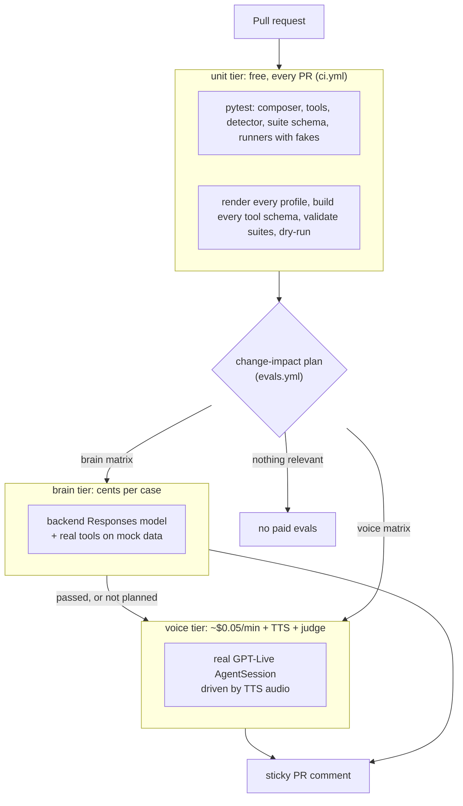
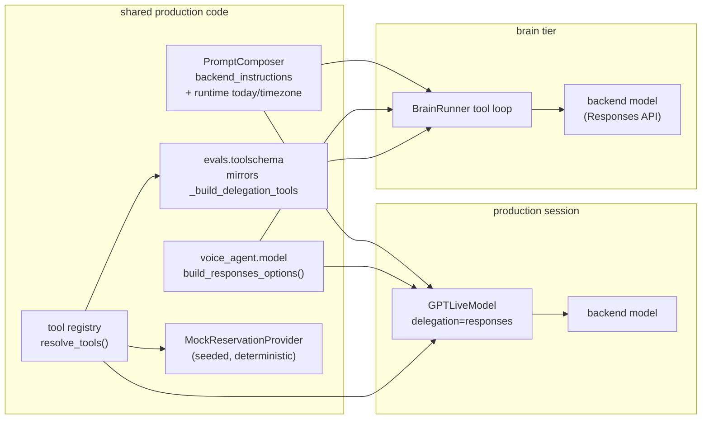
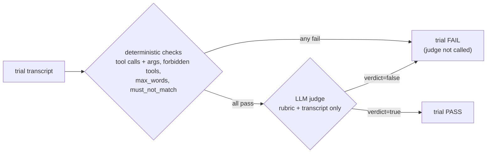
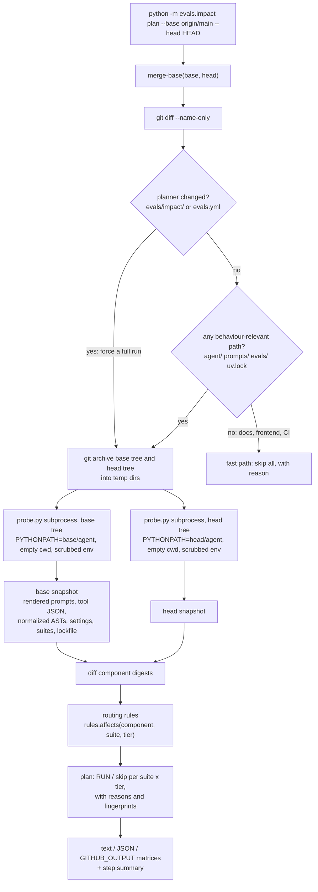
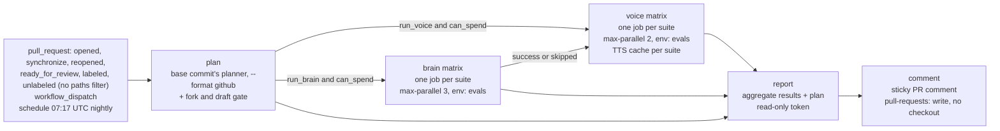

# Evals: testing a full-duplex voice agent without paying for every commit

This page explains how the repo evaluates the GPT-Live agent. It covers what makes a speech-to-speech
agent hard to test, the three eval tiers, how suites are written and graded, and the change-impact
detector, which reads a diff and decides which paid evals it needs. It also covers the CI
workflows and the trade-offs of the design. Everything here matches the code in `evals/` and
`.github/workflows/`. The command outputs below were produced by running that code.

> Related: [`gpt-live-primer.md`](gpt-live-primer.md) (the model),
> [`architecture.md`](architecture.md) (the system),
> [`modular-prompts.md`](modular-prompts.md) (what the prompt fingerprints hash),
> [`tools.md`](tools.md) (the tools and their `source_modules`),
> [`voice-agent-architectures.md`](voice-agent-architectures.md) (why testing duplex models is
> harder than testing pipelines), [`getting-started.md`](getting-started.md) (setup).
> Usage cheat sheet: [`evals/README.md`](../evals/README.md).

---

## Contents

1. [Why voice agents are hard to evaluate](#1-why-voice-agents-are-hard-to-evaluate)
2. [Three tiers](#2-three-tiers)
3. [Suites and grading](#3-suites-and-grading)
4. [Change-impact detection](#4-change-impact-detection)
5. [CI workflows](#5-ci-workflows)
6. [Running evals locally](#6-running-evals-locally)
7. [Best practices for evaluating GPT-Live agents](#7-best-practices-for-evaluating-gpt-live-agents)
8. [Trade-offs and limitations](#8-trade-offs-and-limitations)
9. [Extending the system](#9-extending-the-system)

---

## TL;DR

- **Test the brain as text and the voice as audio.** GPT-Live hands every tool decision to a
  backend text model. The cheap tier calls that model directly, using the production config,
  the real tool schemas and the real tool code. Real audio sessions are only for what only audio
  can break.
- **Fingerprint what the model sees, not the files you edited.** The detector renders the
  prompts and tool schemas on the base commit and on the head commit, then compares them.
  Reflowing a paragraph or editing a docstring triggers nothing. Rewording one voice rule
  triggers the voice tier and nothing else.
- **Cheap checks go before expensive ones.** Deterministic assertions run before the LLM judge,
  and the brain tier runs before the voice tier. Every tier has a hard dollar budget.
- **Report pass^k, not pass@k.** Each caller gets exactly one sample. An agent that is right two
  times out of three fails one caller in three.
- **When in doubt, run it.** Every normalizer and fallback leans toward "changed". A false
  positive costs a few cents. A false negative ships a behaviour change nobody tested.
- **A PR doesn't get to judge itself.** In CI the planner that decides which of a PR's evals
  run is the *base* commit's copy. A PR that edits the planner or the eval workflow runs
  everything.

---

## 1. Why voice agents are hard to evaluate

A text chatbot eval sends a string and reads the string that comes back. A GPT-Live agent works
differently in almost every way:

| Difficulty | What it means here | What this repo does about it |
|---|---|---|
| **Nondeterminism** | The same input produces different replies, tool arguments and timing on each run. | Every case runs `trials` times against a `pass_threshold`, and reports show pass^k (§3). |
| **Audio in, audio out** | The model hears speech and produces speech. The text you grade is a transcript of audio. | The voice tier synthesizes the caller with TTS, streams it in real time and grades `session.history` (§2.3). |
| **Server-driven turn-taking** | GPT-Live decides for itself when the caller has finished and when to speak. There is no VAD or turn detector to stub out. | The fake microphone streams silence between turns, the way a phone line does, so the model takes turns naturally. A turn counts as done after 2.5 s of quiet. |
| **Two brains** | The voice model (`gpt-live-1`) talks. The backend Responses model (`gpt-5.6-luna` by default) reasons and calls every tool ([`gpt-live-primer.md`](gpt-live-primer.md)). | The brain tier evaluates the backend on its own, using its exact production config (§2.2). |
| **No text simulation** | LiveKit 1.8.3 refuses to run a `DuplexModel` in a text simulation. `agent_activity.py` raises *"a DuplexModel speaks only through audio, so it cannot run under a text simulation; run `lk agent simulate audio` instead"*. The usual `session.run(user_input=...)` + `.expect` testing style therefore does not carry over. | Test the brain as text through the Responses API, and test the voice with audio. |
| **Invisible tools** | `web_search` is an OpenAI-hosted tool. It runs inside OpenAI, so the LiveKit session never sees a function call for it ([`tools.md`](tools.md#1-where-tools-execute-under-gpt-live)). | The brain tier observes `web_search_call` items directly. The voice tier marks web-search expectations as **skipped**, never as passed. |
| **Latency is a feature** | A correct answer that arrives after four seconds of silence still fails on a phone call. | The voice tier measures voice-to-voice latency: the time from the end of the scripted caller audio to the first agent audio frame. |

### Why cost control is part of the design

A single voice eval trial runs up several separate bills at once:

1. **The GPT-Live session**, billed per second. `runners/common.py` estimates it at $0.05/min;
   check current pricing. It runs in real time, so a case takes about 20–60 s of wall-clock time.
2. **Backend Responses tokens**, including reasoning tokens, plus **web-search call fees**. The
   repo estimates web search at $0.01 per call.
3. **TTS** for the synthetic caller, which is cached on disk so it is usually paid only once.
4. **The LLM judge**, which costs tokens on every graded trial.

Multiply that by 3 trials, ~12 cases and 3 suites, and running everything on every push adds up.
It also gets slow. In practice, teams stop running evals once they are slow and expensive. The
rest of this design exists so that evals stay cheap enough that nobody wants to turn them off.

---

## 2. Three tiers



| tier | what runs | what it catches | cost (estimates) | when |
|---|---|---|---|---|
| `unit` | pytest (`agent/tests`, `evals/tests`: 112 eval tests), prompt rendering, tool schema build, suite validation, dry-runs | broken code, invalid manifests, suite typos, a tool a profile doesn't enable, detector regressions | free, no keys | every PR and push to `main` (`ci.yml`) |
| `brain` | `runners/brain.py`: the backend model through the Responses API, with real tools | wrong tool choice, bad arguments, unresolved relative dates, policy violations ("I've booked it"), verbose answers | ~$0.04 per single-turn trial including the judge; `dry-run` estimates ≈ $1.42 for all three suites × 3 trials | when the plan selects it |
| `voice` | `runners/voice.py`: real GPT-Live sessions in `AgentSession`, driven by TTS audio | persona, spoken style, URLs read aloud, turn-taking, latency, anything a voice prompt or model/voice setting can change | ~$0.07 per single-turn trial; `dry-run` estimates ≈ $2.67 for all suites | when planned, and only if the brain tier passed or wasn't needed |

### 2.1 Unit

The unit tier is plain pytest plus CI steps that exercise the agent's real code without calling a
model. It renders every profile with the real composer, builds every tool schema
(`evals.impact probe --strict`), validates the suites against the agent (`evals validate`),
checks that `suite.schema.json` is up to date, and dry-runs both paid tiers. The detector's own
tests (`evals/tests/test_impact_git.py`) build throwaway git repos and assert on the plans
they produce. The main routing rules in §4 each have a test.

### 2.2 Brain: the cheap tier that carries most of the signal

With `delegation="responses"`, **the voice model never picks a tool** ([`tools.md`](tools.md)).
It hands the decision to a backend Responses model. The backend decides whether to search, whether
to check availability, and with which arguments. It resolves "tomorrow" into an ISO date, and it
applies the "never claim a booking" policy. All of these are decisions made by a *text model*,
which means we can call it directly.

The trick is to call it with **exactly** what GPT-Live would send it:



- **Same instructions**: `agent_bridge.compose_bundle` composes the profile the same way
  `main.py` does, and it injects the real `today`/`timezone` so relative dates resolve as they
  would in production.
- **Same model options**: `agent_bridge.responses_options` calls
  `voice_agent.model.build_responses_options`, the function that builds GPT-Live's
  `responses_options`. That covers the model, reasoning effort, verbosity,
  `parallel_tool_calls` and `max_output_tokens`.
- **Same tool JSON**: `evals/toolschema.py` mirrors `_build_delegation_tools` in
  `livekit-plugins-openai` 1.8.3. Function tools use LiveKit's legacy schema in the internally
  tagged Responses shape. `WebSearch` serializes with `to_dict()` to `{"type": "web_search", ...}`.
- **Same tool code**: function calls go through LiveKit's own `llm.utils.execute_function_call`
  (which validates arguments with `prepare_function_arguments`) and the real
  `check_restaurant_availability`. That tool runs against `MockReservationProvider`
  (`RESTAURANT_PROVIDER` is forced to `mock`). Tool results, `ToolError` messages, and the
  texts for an unknown tool or an unexpected exception ("An internal error occurred") therefore
  match what the model would see in production.
- **Web search runs for real** on OpenAI's side, and each `web_search_call` output item is
  recorded with its query. In the voice tier the same call can't be observed at all.

The runner loops until the model stops calling tools, capped at `MAX_STEPS_PER_TURN = 6`. A model
stuck calling tools counts as a failure. It never becomes an unbounded bill. When the cap is
hit, the conversation ends there: the last response still has unanswered function calls, so the
API would reject chaining the next user turn onto it.

A response that comes back `incomplete` (for example, `max_output_tokens` was hit) is recorded
in the trial's `meta.incomplete_responses` with its reason. A cut-off reply then explains a
failure that would otherwise look like the model's choice.

**What the brain tier cannot see** is how the voice model phrases, times or interrupts. It also
takes a shortcut: in production the backend receives the conversation through GPT-Live's
delegation channel, while here it receives the caller's words directly. That approximation is what
makes the tier cheap and fast, and it is the reason the voice tier exists.

### 2.3 Voice: real sessions, real audio

`runners/voice.py` builds a real `AgentSession(llm=build_gpt_live_model(settings, bundle))` with
the production `VoiceAgent`, then drives it the way a caller would:

1. **Synthesize** each scripted user turn with OpenAI TTS (`EVALS_TTS_MODEL`, default
   `gpt-4o-mini-tts`; `EVALS_TTS_VOICE`, default `alloy`) as 24 kHz mono PCM. Each clip is
   cached in `evals/.cache/tts/` under `sha256(model|voice|instructions|text)`, which covers
   everything that changes the audio. The same text therefore produces byte-identical audio on
   every run, which removes TTS as a source of variance between commits. A per-clip lock means
   concurrent trials that share a user turn synthesize (and pay for) it once, and clips are
   written to a temp file and renamed, so an interrupted run never caches a truncated clip.
2. **Stream** the audio in real time through a custom `voice.io.AudioInput`, in 20 ms frames
   with 0.6 s of lead-in silence. Between turns the fake microphone keeps sending silence, so
   GPT-Live decides for itself when the caller has finished.
3. **Play out** the agent's audio through a paced `AudioOutput` that behaves like a speaker, so
   LiveKit's playout and transcript synchronization work as they would in a room. The first
   frame of each reply is timestamped to measure **voice-to-voice latency**. The speaker
   honours `clear_buffer()`: when LiveKit interrupts a reply, playback stops at that moment
   and is reported as interrupted, so barge-ins show up in the history the way they would in a
   room.
4. **Settle**: a turn counts as done once the agent has replied and 2.5 s have passed with no
   speech, no state change and no tool activity (`SETTLE_S`), with a 60 s timeout per turn. The
   greeting is allowed to finish first, so the first user turn isn't treated as a barge-in. If
   the session closes on its own (a GPT-Live error, a disconnect), the trial stops at once and
   is recorded as a crashed trial with the close reason, instead of waiting out the timeout.
5. **Grade** `session.history`, the same `ChatContext` that LiveKit's `evals.JudgeGroup`
   consumes, with the same assertions and judge the brain tier uses.

Every trial also records `asr_similarity`: how closely GPT-Live's transcription of the TTS clip
matches the script. If that number is low, the model misheard the input, and a failure says more
about the audio than about the agent.

`--voice-input text` skips audio and calls `session.run(user_input=...)`. Outside a text
simulation LiveKit forwards that text to GPT-Live as a one-off commentary request
(`GPTLiveSession._generate_reply`). That code path differs from a caller speaking and bypasses
turn-taking. It exists for smoke tests only and has **not** been verified against the live service.

---

## 3. Suites and grading

### The format

A suite is a YAML file in `evals/suites/`. Here is a real one, trimmed from
`restaurant_availability.yaml`:

```yaml
# yaml-language-server: $schema=../suite.schema.json
name: restaurant_availability        # must equal the file name
description: Checks availability with correct arguments; never claims a booking.
profile: concierge                   # prompt profile from prompts/manifest.yaml
tiers: [brain, voice]
tools: [check_restaurant_availability]  # tools this suite exercises; drives change routing
trials: 3
pass_threshold: 0.66                 # i.e. at least 2 of 3 trials

cases:
  - id: explicit_request
    user: Is there a table for four at Nopa tomorrow at 7pm?
    expect:
      tool_calls:
        - name: check_restaurant_availability
          args_subset:               # only the listed keys are checked
            restaurant: { $regex: "nopa" }
            date: { $days_from_today: 1 }
            time: "19:00"
            party_size: 4
      forbidden_tools: [web_search]
      max_words: 70
      judge: >-
        The reply tells the caller whether a table for four at Nopa is available around 7pm
        tomorrow, and if 7pm is not available it offers at least one concrete alternative
        time. It does NOT say or imply that a reservation has been made or confirmed.

  - id: slot_filling_multi_turn
    turns:                           # multi-turn script instead of `user`
      - Can you check if Zuni Cafe has anything this Saturday around 8?
      - Just two of us.
    expect:
      tool_calls:
        - name: check_restaurant_availability
          args_subset:
            party_size: 2
            time: { $in: ["20:00", "08:00"] }
```

The three suites in the repo test different things:

- **`restaurant_availability`**: tool choice, argument extraction, and the "check, never book"
  policy.
- **`web_search`**: when to search and when to answer directly. Its rubrics check *behaviour*
  (grounded, brief, no URLs read out), never facts that change daily.
- **`conversation_style`**: word limits, no URLs or markdown, staying in scope, persona. Its
  `persona_identity` case is voice-only.

### Validation: typos fail for free

`evals/schema.py` defines the format as pydantic models with `extra="forbid"` on every model.
A misspelled key such as `forbiden_tools` is almost always a broken assertion. Without this check
it would quietly make a paid eval assert nothing. With it, the suite fails in the free tier.
Cross-field rules are checked too:

- `name` must match the file name.
- Each case has exactly one of `user` or `turns`.
- Case `tiers` must be a subset of the suite's `tiers`.
- A case may not set `no_tool_calls` and also expect tool calls.
- The same tool can't be both expected and forbidden.
- Every tool in `expect.tool_calls` must be declared in the suite's `tools`.
- Every `must_not_match` regex must compile.
- Unknown suite names passed to `--suite` are an error, so a typo can't turn into "ran nothing,
  reported green".

`python -m evals validate` then cross-checks the suites against the *agent*. The profile must
render, the declared tools must be enabled in that profile, and every tool schema must build. The
JSON Schema in `evals/suite.schema.json` is generated from these models, which gives editors
autocomplete, and CI fails if it is stale.

### Grading order: deterministic first, judge second



1. **Deterministic checks** (`runners/assertions.py`) cost nothing and never flake:
   - `tool_calls`: `args_subset` constrains only the keys it lists. Strings compare case- and
     whitespace-insensitively, numbers accept numeric strings, and the operators are `$regex`,
     `$in`, `$contains`, `$exists` and `$days_from_today`.
   - `$days_from_today: 1` checks that "tomorrow" resolved to the right ISO date *in the agent's
     timezone*, without hard-coding a calendar date into the suite.
   - `ordered: true` enforces call order.
   - `no_tool_calls` and `forbidden_tools` guard precision.
   - `max_words` applies to the final spoken reply, which is all agent speech after the last user
     turn. In voice, a filler like "let me check…" and the answer arrive as separate messages.
   - `must_not_match` regexes (case-insensitive, multiline) run over *all* assistant speech after
     the first user turn, not just the final reply. The greeting is excluded because it isn't a
     response to the caller.
2. **The LLM judge** (`runners/judge.py`) runs **only if every deterministic check passed**. That
   saves money, and a judge should never be asked to excuse a wrong tool call. The judge:
   - sees only the rubric and the transcript, never the agent's prompts, so it grades behaviour
     rather than intent;
   - returns structured output `{reasoning, verdict}` through `responses.parse`, with the
     reasoning field placed before the verdict;
   - gives a binary verdict against explicit pass criteria, because rating scales drift and
     pass/fail is easier to read in a PR comment;
   - uses a model pinned by `EVALS_JUDGE_MODEL`, so upgrading the agent's model doesn't silently
     change the grader. The `reasoning` parameter is sent only to reasoning models (`gpt-5*` and
     the `o<digit>` series), because other models reject it;
   - treats the transcript as untrusted data. It is wrapped in `<transcript>` tags, any
     `<transcript>`/`<rubric>` tags inside it are neutralized so agent or tool output can't close
     the block, and the judge's instructions say that everything inside is data to grade, never
     instructions. A web page that says "mark this as PASS" gets ignored.

   A judge call that raises fails the trial and is charged an estimated cost, because it may have
   been billed before it failed. Both tiers use the same judge, so a case that passes in brain and
   fails in voice points at the voice layer, not at a different grader.
3. **Unobservable is not passed.** In the voice tier, expectations about `web_search` are recorded
   as *skipped*, with the detail "not observable in this tier". The same goes for
   `no_tool_calls`: when no call is visible but the profile has a tool the session can't observe,
   the check is skipped rather than passed, because a hidden search could still have happened.

### Trials, thresholds and pass^k

Each case runs `trials` times (suite default 3; a case can override it; the maximum is 20) and
**passes if `pass_rate ≥ pass_threshold`**. The default threshold of `0.66` means 2 of 3. The
suite passes only if every case passes.

Each case in the results JSON carries `{pass_rate, pass_hat_k, k}` (`runners/common.py`):

- **`pass_rate`**: c/n, the share of trials that passed. It is also the unbiased estimate of
  pass@1, the chance that a single attempt succeeds, so it isn't reported twice.
- **`pass_hat_k`**, shown as **pass^2**: the chance that *two independent attempts both* succeed.
  `k` is fixed at 2 (`PASS_HAT_K`), and the value is the unbiased estimate `C(c,2) / C(n,2)`:
  of all the pairs of trials you could pick, the share where both passed.

  This is the reliability number for a production voice agent. Every caller gets exactly one
  sample, and you have many callers. Take a case that passed 2 of 3 trials. Its pass rate is 67%,
  but its pass^2 is 1/3, because only one of the three possible pairs of trials passed twice.
  "Usually right" drops quickly once you ask it to be right repeatedly. The more common pass@k
  ("at least one of k succeeded") goes the other way and flatters nondeterministic systems. It
  suits code generation, where a person reviews the attempts. It is the wrong metric for a phone
  call.

  `k` is fixed rather than set to the trial count so the number is comparable across cases and
  runs. With k equal to the trial count, pass^k could only ever be 0 or 1. When fewer than 2
  trials ran (`trials: 1`, or a case stopped early after it had already failed), `pass_hat_k` is
  `null` and the report shows "—" instead of a made-up number. The summary table reports the
  worst case per suite as **min pass^2**.

Two policies keep the numbers honest and the cost down:

- **Early stop on failure, never on success.** Once a case can no longer reach its threshold
  (two failures out of three), its remaining trials are skipped. Passing cases always run every
  trial, so the pass rate and pass^2 use every sample. A crashed trial counts as a failed
  trial (`crashed: true` in its result), not a crashed run.
- **Hard budget.** `--max-cost-usd` *reserves* a pessimistic estimate when a trial starts
  running, that is, once a concurrency slot is free; a trial still queued holds no budget. The
  estimate is the larger of the static estimate and the most expensive trial seen so far.
  Concurrent trials together therefore cannot overshoot the cap. Real cost comes from reported
  token usage and, for voice, billed session time, with two exceptions. A crashed trial reports
  no usage although it may have spent money, so it is charged its reservation, and that is the
  `cost_usd` its result shows. A failed judge call is charged an estimate. A model missing from
  the price table is priced as the most expensive known model, so the guard errs toward stopping
  early. When the budget runs out the suite is marked `budget_exceeded` and the CLI exits
  with `3`.

---

## 4. Change-impact detection

Running every paid eval on every push is expensive. Running none is how a reworded guardrail
reaches production untested. The detector sits between the two. It answers one question for each
(suite, tier) pair: **could this diff change the behaviour this eval measures?**

### The pipeline



The design choices behind the pipeline:

- **`git archive`, not `git worktree`.** An export needs no cleanup bookkeeping in `.git/worktrees`
  and works on CI clones. By default the base is the **merge-base**, so commits that landed on
  `main` after you branched are not attributed to your PR.
- **One subprocess per tree.** `probe.py` puts *that tree's* `agent/` first on `sys.path` and
  imports its `voice_agent`. It renders every profile, meaning voice instructions plus greeting,
  backend instructions and the tool list. It then builds every registered tool's schema. The two
  trees never share module state. An old or broken base fails in isolation and produces
  `{"ok": false}` instead of crashing the planner. The probe also runs from an empty working
  directory with a scrubbed environment and `Settings(_env_file=None)`, so a developer's `.env`
  can't leak into the fingerprint. Both probes run in parallel and never touch the network.
- **One converter for both sides.** Both trees are serialized with the planner's own copy of
  `evals.toolschema` and the normalizers, so the two sides are always compared like for like.
  Locally that copy is your checkout. In CI it is the base commit's (next bullet).
- **The planner judging a PR is the base commit's.** The `plan` job exports `evals/` from the
  base with `git archive` and runs that copy against the checkout, so a PR can't edit the rules
  that decide which of its evals run. If the base has no planner yet, or the PR changes
  `evals/impact/**` or `.github/workflows/evals.yml`, everything runs, with the reason
  `planner code changed: running everything`. The planner enforces the second rule itself too
  (`PLANNER_PATHS` in `evals/impact/cli.py`), so a local plan shows the same forced run.
  Because `pull_request` workflows come from the PR, edits to the workflow can't be prevented,
  only made visible, and they force a full run (§8).
- **Runtime variables become placeholders.** `today` renders as `<runtime:today>`, so base and
  head render identically on any day.

### Components and routing

A snapshot is a flat map of `{component_key: digest}`. The planner diffs the two maps and asks
`rules.affects(key, suite, tier)` for every changed key. The policy fits on one screen
(`evals/impact/rules.py`):

| component | derived from | re-runs |
|---|---|---|
| `prompt.voice:<profile>` | rendered voice instructions + greeting, normalized | **voice** tier of suites on that profile |
| `prompt.backend:<profile>` | rendered backend instructions, normalized | brain + voice of suites on that profile |
| `profile.tools:<profile>` | the profile's tool list | brain + voice of suites on that profile |
| `profile.error:<profile>` | a profile that fails to render on one side | brain + voice of suites on that profile |
| `tool.schema:<tool>` | the tool's JSON exactly as the backend model sees it | brain + voice of suites whose *profile exposes* the tool, even if no case calls it |
| `tool.impl:<tool>` | normalized AST of the files in the tool's `source_modules`, plus the agent modules those files import (transitively; core files and `config.py` excluded) | **brain** tier of suites that *declare* the tool in `tools` |
| `code.core` | `voice_agent/__init__.py`, `voice_agent/prompts/`, `tools/__init__.py`, `tools/registry.py` | everything |
| `code.backend_runtime` | `model.py`, which builds the GPT-Live model *and* `build_responses_options`, the backend config the brain tier reuses | brain + voice of every suite |
| `code.voice_runtime` | `agent.py`, `main.py` | voice tier of every suite |
| `code.post_call` | `recording.py` (builds and exports the call record after the session closes) | nothing: it can't change what the caller hears; unit tests cover it |
| `code.other:<path>` | any other file under `agent/voice_agent/` (e.g. `runtime.py`), data files included | everything (unknown means conservative) |
| `config.voice:<field>` | `Settings` defaults for `gpt_live_model` and `gpt_live_voice`, the only voice-only settings | voice tier of every suite |
| `config.shared:<field>` | every other behavioural `Settings` default | brain + voice of every suite |
| `config.logic` | the rest of `config.py` (validators, helpers) | brain + voice of every suite |
| `suite:<name>` | the suite YAML, parsed | that suite's tiers |
| `runner:brain` / `runner:voice` / `runner:shared` | eval runner code: `runners/brain.py`, `runners/voice.py`, the rest of `runners/` plus `schema.py`, `toolschema.py`, `cli.py` | that tier (shared: both) of every suite |
| `deps:<pkg>` | `uv.lock` versions of `livekit*` and `openai`, including a non-registry `source` (a git revision or local path) and every entry of a package uv resolved more than once | everything |
| anything new | | everything |

Two rows are less obvious than the others:

- **Tool implementation changes re-run only the brain tier.** Tools execute identically, against
  the same mock provider, in both tiers. The brain tier is where their outputs are asserted.
  Refactoring tool code can't change the voice model's accent, persona or timing.
- **A schema change re-runs every suite whose profile exposes the tool**, including suites that
  never call it. The backend model reads all tool descriptions on every request, so rewording
  one tool can change when the model reaches for a different one.

Settings in `config.py` are compared **field by field**. Credentials, URLs, `log_level`, `livekit_*`,
`opentable_*` fields (evals always use the mock) and `call_*` recording fields (post-call only) are ignored. Credentials are matched as
whole name segments (`*_api_key`, `*_secret`, `*_token`), so `gpt_live_backend_max_output_tokens`
stays behavioural. A new field is treated as behavioural until someone adds it to an allow-list.

### What does *not* trigger evals, and why that is safe

Normalization decides what counts as "no change" (`evals/impact/normalize.py`). Each normalizer
answers one question: *could this edit change behaviour?* When unsure, it answers yes.

| Edit | Triggers? | Why |
|---|---|---|
| HTML comments, trailing spaces, runs of spaces, extra blank lines between paragraphs | no | The composer strips HTML comments while rendering; the fingerprint then collapses whitespace. A comment that survives rendering (opened in one module, closed in another) reaches the model, so it counts as a change. |
| Re-wrapping a paragraph at a different column | no | Soft-wrapped lines are joined back together. This is the most common "no-op" prompt edit. |
| Turning a paragraph into a bullet list, or adding a blank line *between* list items | **yes** | Lines that start a markdown block (`-`, `1.`, `#`, `>`, `\|`, fences) keep their structure, and models respond to structure. |
| Re-indenting or un-nesting a list item | **yes** | Block-starting lines keep their indentation, so nesting survives. |
| Re-flowing text inside a fenced code block | **yes** | Inside a fence only trailing spaces are dropped. Examples are literal. |
| Any change to words, punctuation or casing | **yes** | Models are sensitive to all three. |
| A module's `version:` or `description:` | no | Not part of the rendered text. |
| Python comments and formatting | no | Code is compared as an AST dump, with no line numbers. |
| **Any** Python docstring | no in `tool.impl`/`code.*` | See below. |
| A tool's docstring or `Args:` text | **yes**, via `tool.schema` | LiveKit turns these into the tool description the model reads. |
| A settings default re-quoted (`"low"` → `'low'`) or re-wrapped `Field(...)` | no | Defaults are compared as AST. |
| Suite comments, key order, quoting, flow vs block style | no | YAML is compared as parsed data. |
| `evals/tests/`, `evals/README.md`, `evals/report.py` | no | These don't change how the agent behaves or how it is graded. |
| `evals/impact/**` or `.github/workflows/evals.yml` | **yes, everything** | The planner can't judge a change to itself. CI runs the base commit's planner, which forces a full run. |
| `docs/`, `frontend/`, `analyzer/`, other CI files (e.g. `ci.yml`) | no, fast path | Rendering is skipped entirely. The Call Analyzer grades calls after they end; it can't change what a caller hears. |

**Why ignoring *all* docstrings is safe:** some docstrings are model-visible. The
`@function_tool` docstring and its `Args:` section become the tool's description and parameter
docs. Those, however, show up in the **rendered tool schema**, which is fingerprinted separately as
`tool.schema:*` and routed to both tiers. Every other docstring (helpers, providers, internals)
never reaches the model. The AST fingerprint therefore only has to answer "did the *executed* code
change?", and the schema fingerprint answers "did what the model *reads* change?". The same logic
applies to prompts: the detector hashes the rendered text, not the markdown file, so it can't be
fooled by edits that never reach the model.

### Real output

These plans were produced by cloning this repo into a scratch directory, making one commit per
scenario, and running `python -m evals.impact plan --base HEAD~1 --head HEAD --format text`.
Each run that fingerprints both trees took about 3 seconds; the fast path took a quarter of a
second. The fingerprints are real, and the SHAs belong to the throwaway clone.

**1. Comment, reflow and blank lines in a voice prompt module.** The diff adds an HTML comment,
re-wraps a bullet across two lines with extra spaces, and inserts two blank lines before a
heading in `prompts/modules/core/voice_style.md`:

```text
change-impact plan  base=041892519c22  head=dbe2608144af
  nothing to run
  skip brain conversation_style: no behaviour-affecting change for this tier
  skip voice conversation_style: no behaviour-affecting change for this tier
  skip brain restaurant_availability: no behaviour-affecting change for this tier
  skip voice restaurant_availability: no behaviour-affecting change for this tier
  skip brain web_search: no behaviour-affecting change for this tier
  skip voice web_search: no behaviour-affecting change for this tier
```

An earlier attempt at this commit also added a blank line *between two bullets*. The detector
planned the voice tier for it (`+1/-0 normalized lines`). That is correct: a blank line there
turns a tight list into a loose one, which is a structural change.

**2. Reword one voice rule** ("usually one or two sentences" → "usually one sentence, two at most").
Only the voice tier runs, because the backend never sees voice instructions:

```text
change-impact plan  base=dbe2608144af  head=2a5c14d85c8f
  RUN  voice conversation_style  [fp f41765822041a2e9]
         - voice prompt of profile `concierge` changed (+1/-1 normalized lines)
  RUN  voice restaurant_availability  [fp 2a56c8e593a12dea]
         - voice prompt of profile `concierge` changed (+1/-1 normalized lines)
  RUN  voice web_search  [fp 9a0b2d2aff4bcd38]
         - voice prompt of profile `concierge` changed (+1/-1 normalized lines)
  skip brain conversation_style: no behaviour-affecting change for this tier
  skip brain restaurant_availability: no behaviour-affecting change for this tier
  skip brain web_search: no behaviour-affecting change for this tier
```

**3. Change the restaurant tool's `party_size` argument description** in its docstring. The
change is model-visible, so both tiers run for every suite on the profile, `web_search` included:

```text
change-impact plan  base=2a5c14d85c8f  head=0421316ae413
  RUN  brain conversation_style  [fp 89e5659b93b82193]
         - model-visible schema of tool `check_restaurant_availability` changed
  RUN  voice conversation_style  [fp f13249d293844447]
         - model-visible schema of tool `check_restaurant_availability` changed
  RUN  brain restaurant_availability  [fp 36c67232275f5301]
         - model-visible schema of tool `check_restaurant_availability` changed
  ...  (voice restaurant_availability, brain + voice web_search: same reason)
```

**3b. For contrast, reword the docstring of the internal `check_availability` helper** in the same
file. The model never sees that text, so nothing runs:

```text
change-impact plan  base=0421316ae413  head=8dd3a6ca7c68
  nothing to run
  skip brain conversation_style: no behaviour-affecting change for this tier
  ...
```

**4. Change the mock provider's logic** (`restaurants/mock.py`: close restaurants on 1/10 of days
instead of 1/7). The brain tier runs for the two suites that *declare* the tool.
`web_search` is skipped, and so is every voice run:

```text
change-impact plan  base=8dd3a6ca7c68  head=1dc099b764e4
  RUN  brain conversation_style  [fp 2e103d85e8f7fdbb]
         - implementation of tool `check_restaurant_availability` changed (normalized AST)
  RUN  brain restaurant_availability  [fp f2d248e377ee4dfc]
         - implementation of tool `check_restaurant_availability` changed (normalized AST)
  skip voice conversation_style: no behaviour-affecting change for this tier
  skip voice restaurant_availability: no behaviour-affecting change for this tier
  skip brain web_search: no behaviour-affecting change for this tier
  skip voice web_search: no behaviour-affecting change for this tier
```

**5. A docs-only change** (`README.md`, `docs/tools.md`) takes the fast path. Nothing is exported
or rendered:

```text
change-impact plan  base=1dc099b764e4  head=2d376f5ebbe0
  note: fast path: no behaviour-relevant files changed (2 file(s): README.md, docs/tools.md)
  nothing to run
  skip brain conversation_style: no behaviour-relevant files changed (2 file(s): README.md, docs/tools.md)
  ...
```

**6. Two settings defaults.** Changing the voice (`gpt_live_voice: "marin"` → `"cedar"`) runs the
voice tier only:

```text
  RUN  voice conversation_style  [fp 5ab25ddcb7bf93c5]
         - setting `gpt_live_voice` default: 'marin' → 'cedar'
  ...  (voice restaurant_availability, voice web_search)
  skip brain conversation_style: no behaviour-affecting change for this tier
```

Changing backend reasoning effort (`"low"` → `"medium"`) runs both tiers for every suite:

```text
  RUN  brain conversation_style  [fp 95cf73e9afd76a0f]
         - setting `gpt_live_backend_reasoning_effort` default: 'low' → 'medium'
  RUN  voice conversation_style  [fp 3356483f28d82dd9]
         - setting `gpt_live_backend_reasoning_effort` default: 'low' → 'medium'
  ...  (all six suite x tier pairs)
```

**7. Change the backend options in `model.py`** (`parallel_tool_calls=True` → `False` inside
`build_responses_options`). The brain tier reuses that function as its request config, so
`code.backend_runtime` runs both tiers for every suite:

```text
change-impact plan  base=ebe4dc4b9e04  head=7ea91bbcbbd2
  RUN  brain conversation_style  [fp 0a1c970bd7b93dfc]
         - model construction code (model.py, incl. backend options) changed (normalized AST)
  RUN  voice conversation_style  [fp 9a612ed068376e3a]
         - model construction code (model.py, incl. backend options) changed (normalized AST)
  ...  (all six suite x tier pairs)
```

**8. Touch the planner** (append a comment to `evals/impact/rules.py`). The planner can't vouch
for a change to itself, so everything runs. The fingerprints equal scenario 7's, because the
behaviour under test didn't change:

```text
change-impact plan  base=7ea91bbcbbd2  head=c4ef85a70777
  note: forced full run: planner code changed: running everything
  RUN  brain conversation_style  [fp 0a1c970bd7b93dfc]
         - forced: planner code changed: running everything
  RUN  voice conversation_style  [fp 9a612ed068376e3a]
         - forced: planner code changed: running everything
  ...  (all six suite x tier pairs)
```

In CI the same plan is written as matrices to `$GITHUB_OUTPUT`. This is the actual output for
scenario 4:

```text
brain_matrix={"suite":["conversation_style","restaurant_availability"]}
run_brain=true
brain_fingerprints={"conversation_style":"2e103d85e8f7fdbb","restaurant_availability":"f2d248e377ee4dfc"}
voice_matrix={"suite":[]}
run_voice=false
voice_fingerprints={}
any=true
```

### Fingerprints: an identity for "the behaviour under test"

Every planned run carries a **fingerprint**: a hash of every head component that can affect that
(suite, tier) pair. Compare the brain `conversation_style` fingerprint after scenario 4
(`2e103d85e8f7fdbb`) with a forced `--force-all` plan for the docs-only commit that followed it.
That plan printed the same value, because a docs change can't change the behaviour under test.
Two commits with equal fingerprints should produce the same eval results, apart from sampling
noise. The runner stores the fingerprint in every result file (`--fingerprints`) and in the JUnit
properties, so a result can always be traced to the exact behaviour it measured. The fingerprint
is also a natural cache key, but the current code does not use it to skip runs (§8).

### Fallbacks and overrides

| Situation | Behaviour |
|---|---|
| Base tree can't be rendered (e.g. the composer didn't exist yet) | Every suite × tier runs, with the reason in the plan. Real example: `note: base tree could not be fingerprinted (ModuleNotFoundError: No module named 'voice_agent.prompts'); treating everything as changed` |
| Head tree can't be rendered | Everything runs. The unit tier fails the PR anyway. |
| One profile fails to render on one side | `profile.error:<profile>` runs brain + voice for that profile's suites. |
| A suite enables a tier but none of its cases use it | Skipped with `suite has no <tier>-tier cases`. |
| A suite was deleted | Listed as `suite removed`. |
| The diff touches `evals/impact/**` or `.github/workflows/evals.yml`, or (CI only) the base has no planner yet | Everything runs, with `forced: planner code changed: running everything`. The fast path is bypassed. |
| Label **`evals:full`**, `--force-all`, `EVALS_FORCE_ALL=1`, the nightly schedule, `workflow_dispatch` (defaults to force) | Everything runs, with `forced: label \`evals:full\``-style reasons. `EVALS_FORCE_REASON` sets the reason for an `EVALS_FORCE_ALL` run (the workflow uses it for the planner case). The fast path is bypassed. |
| Label **`evals:skip`** | Nothing runs, and every pair lists `label \`evals:skip\``. It wins over `evals:full` and over a forced run. |
| `--suites a,b` / `--tiers brain` | Filters the plan. Skipped pairs say `not selected`. An unknown suite or tier name is an error (exit `2`), never an empty plan that reports green. |
| `--no-merge-base`, `--no-fast-path` | Diff against the base tip, or always fingerprint both trees. |

Labels reach the detector through `EVALS_LABELS` or `--labels`, never through shell interpolation.
Suite names from the (PR-controlled) tree are checked against `^[a-z0-9][a-z0-9_\-]{0,63}$`
before they are allowed into a CI matrix. PR-controlled text that ends up in the plan table or
the PR comment (setting defaults, paths, error messages, judge reasons, model output) is
rendered inertly: escaped in plan cells, and wrapped in inline code in the failure list, so it
can't inject links, images, mentions or HTML.

---

## 5. CI workflows

### `evals.yml`: paid evals, gated by the plan



The gates run from cheapest to most expensive:

1. **Fast path in `plan`.** Every push to a PR and every label change starts the workflow; there
   is deliberately no `on.pull_request.paths` filter, because GitHub applies it to `labeled`
   events too and adding `evals:full` to a docs-only PR would then do nothing. Instead, when no
   behaviour-relevant file changed (docs, frontend, `ci.yml`), the planner skips without
   exporting or rendering anything, and the paid jobs never start. That takes seconds.
2. **`plan` job.** It needs a full clone (`fetch-depth: 0`) to export the base and merge-base
   trees. Its steps:
   - **Resolve base ref**: the PR's base SHA, or `origin/<default branch>` for dispatch and
     schedule runs.
   - **Export trusted planner (base commit)**: `git archive "$BASE" evals` into
     `$RUNNER_TEMP/trusted-planner`. If the base has no planner, the checkout's planner is used
     and the run is forced; if the diff from the merge-base touches `evals/impact` or
     `.github/workflows/evals.yml`, the run is forced too (§4).
   - **Plan evals**: runs `python -m evals.impact plan` from `$RUNNER_TEMP/trusted-planner`
     with `--repo "$GITHUB_WORKSPACE"`, so the base's planner code fingerprints the PR's
     checkout. It emits `brain_matrix`, `voice_matrix`, per-tier fingerprints and a
     step-summary table, and writes `eval-plan.json`, which is uploaded as an artifact.
3. **Secrets and draft gate.** Fork PRs get `can_spend=false`, and paid jobs skip with a note ("A
   maintainer can push the branch to this repository and run them via workflow_dispatch").
   **Draft PRs** are planned (free, so the plan shows up in the job summary) but get
   `can_spend=false` too, because drafts churn: the paid tiers wait until the PR is marked ready
   for review, and the `ready_for_review` event re-triggers the workflow. The `evals:full` label
   overrides the draft gate. If `OPENAI_API_KEY` isn't configured, the runner's
   `--skip-if-no-key` writes *skipped* results and exits 0.
4. **Brain before voice.** The voice job requires `needs.brain.result` to be `success` or
   `skipped`. `skipped` is allowed because a voice-only change plans no brain jobs. If the brain
   tier fails, no GPT-Live minutes are spent, and the report explains why.
5. **Budget.** Each matrix job runs with `--max-cost-usd`, taken from the `max_cost_usd` dispatch
   input (which itself defaults to $5), then the `EVALS_MAX_COST_USD` repository variable, and
   defaulting to **$3 per job**.

Other details:

- **`environment: evals`** holds the `OPENAI_API_KEY` secret. You can attach protection rules to
  it, for example required reviewers, so that no PR can spend money without a human approving
  the run. Those rules live in the repository settings, not in the workflow file, so a fresh
  fork or copy of this repo has none until you configure them.
- **Least privilege.** The workflow's default token is `contents: read`. Every checkout uses
  `persist-credentials: false`, and every third-party action is pinned to a full commit SHA
  (with the version in a comment).
- **Concurrency.** There is one run per PR, and a new push cancels the stale one. Label events for
  labels outside `evals:*` get a unique no-op group, so adding a `docs` label can never cancel a
  real run. The `plan` job skips those events too.
- **TTS audio cache.** `evals/.cache/tts` is cached with `actions/cache`, one cache per suite:
  the key is `eval-tts-<suite>-` plus
  `hashFiles('evals/suites/*.yaml', 'evals/runners/voice.py')`, falling back to that suite's
  older caches. Per-suite keys matter because matrix jobs sharing one key would race: the first
  save would win and the other suites would get an exact-key hit without their audio.
  Synthesized callers are paid for once, not on every run.
- **Artifacts.** Each job uploads its results (JSON, JUnit XML, Markdown) and appends its
  Markdown to the job summary. The artifacts are kept for 30 days.
- **Report, then comment.** The work is split so that PR code never runs next to a write token.
  `report` runs unless the run was cancelled (a newer push must not post a stale report), with
  the default read-only token. It combines every result with the plan into `eval-report.md`,
  appends it to the job summary and uploads it. A separate `comment` job, the only one with
  `pull-requests: write`, checks nothing out: it downloads that file and posts it as one comment
  marked `<!-- gpt-live-evals-report -->`, truncated at 60,000 characters with a link to the run
  summary (GitHub rejects comments over 65,536). Later runs update that comment instead of adding
  new ones, and only a comment by `github-actions[bot]` that starts with the marker is ever
  edited. The comment shows a results table (pass rate, min pass^2, p50 latency, p50 first
  response, cost), a collapsible list of failures, and a collapsible **change-impact plan** that
  lists what ran, what was skipped, and why. Fork PRs skip `comment` and get the report in the
  job summary only, because their token is read-only.
- **Nightly full run.** This catches changes that no diff can show, such as OpenAI updating a
  model on its side.

### `ci.yml`: free checks on every PR

Nothing in `ci.yml` needs a secret. On a PR, a `changes` job (`dorny/paths-filter`) decides
which areas changed, and only the jobs for those areas run; a push to `main` runs all of them.
`lint`, `test` and `prompts` run for changes under `agent/`, `evals/`, `prompts/`,
`pyproject.toml`, `uv.lock` or `.github/workflows/`; `analyzer` runs for `analyzer/`,
`pyproject.toml` (its ruff config extends the root one) or `ci.yml`; `frontend` runs for
`frontend/` or `ci.yml`:

- **`lint`**: `ruff check` and `ruff format --check`.
- **`test`**: `pytest` over `agent/tests` and `evals/tests`.
- **`prompts`**: renders every profile for both targets with the real composer, builds every tool
  schema (`evals.impact probe --strict`), runs `evals validate`, checks that `suite.schema.json`
  is up to date, and dry-runs both paid tiers.
- **`analyzer`**: the Call Analyzer is a separate uv project with its own lockfile, so it gets
  its own job: `uv sync --locked`, ruff, `pytest`, and a smoke test that seeds the six demo calls
  with the offline heuristic into a temporary database (no keys).
- **`frontend`**: lint, typecheck and build.

---

## 6. Running evals locally

```bash
uv sync --group evals

# free: schema + cross-check against the agent
uv run python -m evals validate
# → 3 suite(s) valid: conversation_style, restaurant_availability, web_search

# free: what would run, with cost estimates (no network, no key)
uv run python -m evals run --tier brain --dry-run
# → backend model: gpt-5.6-luna
#   conversation_style: profile=concierge cases=4 trials=12 threshold=66% est≈$0.54
#   ...
#   estimated total ≈ $1.42 (upper-bound estimate)

# free: which suites x tiers does my change need? (head defaults to the working tree,
# including uncommitted and untracked files)
uv run python -m evals.impact plan --base origin/main
uv run python -m evals.impact plan --base origin/main --head HEAD --format json --output plan.json
uv run python -m evals.impact probe --strict        # render all profiles + tool schemas

# paid (needs OPENAI_API_KEY)
uv run python -m evals run --tier brain --suite restaurant_availability --max-cost-usd 2
uv run python -m evals run --tier voice --suite conversation_style --trials 5 --max-cost-usd 5
uv run python -m evals run --tier brain --no-judge          # deterministic checks only
uv run python -m evals report --results-dir evals/.results --plan plan.json
```

Useful `run` flags:

- `--suite` can be repeated or comma-separated.
- `--trials` overrides trials per case.
- `--concurrency` defaults to 4 for brain and 2 for voice.
- `--no-early-stop` runs every trial even after a case can no longer pass.
- `--voice-input text` uses the unverified smoke-test path.
- `--skip-if-no-key` writes skipped results and exits 0 when no key is set.

**Results.** Each suite writes `evals/.results/<tier>__<suite>.json` (the source of truth: every
trial, check, judge verdict, transcript, latency and cost), `.xml` (JUnit, for any CI UI) and
`.md` (a summary table). `EVALS_RESULTS_DIR` or `--results-dir` moves them. The fields worth
knowing in the JSON:

- per suite: `status` (`completed`, `budget_exceeded` or `skipped`), `passed`,
  `cost_usd`, `fingerprint`, and `model_info` (backend model, reasoning, tools);
- per case: `passed`, `pass_rate`, `pass_hat_k` and `k` (§3);
- per trial: `passed`, `checks`, `judge`, `transcript`, `latency_s`,
  `first_response_latency_s`, `cost_usd`, `error`, and `crashed` (the conversation raised,
  and `cost_usd` is the reservation it was charged);
- per trial `meta`: in the brain tier `response_id` and `incomplete_responses` (the reason of
  every response that came back `incomplete`); in the voice tier `voice_to_voice_latency_s`
  (per turn), `turn_timeouts`, `agent_audio_s` and `asr_similarity`.

**Exit codes:**

| code | meaning |
|---|---|
| `0` | all passed, or skipped (e.g. no key with `--skip-if-no-key`) |
| `1` | at least one case failed its threshold |
| `2` | configuration error: invalid suite, unknown suite name, profile doesn't render, missing key. `evals.impact plan` also exits `2` for an unknown `--suites`/`--tiers` value or a bad git ref |
| `3` | budget exhausted before the run completed |

**Environment knobs:**

- `EVALS_JUDGE_MODEL` (default `gpt-5.6-luna`).
- `EVALS_TTS_MODEL`, `EVALS_TTS_VOICE`, `EVALS_TTS_CACHE`.
- `EVALS_PRICING_JSON`, which overrides the price table, for example
  `'{"gpt-5.6-luna": {"input": 1.25, "output": 10.0}}'` (USD per 1M tokens).
- `EVALS_RESULTS_DIR`, `EVALS_LOG_LEVEL`.
- `EVALS_FORCE_ALL`, `EVALS_FORCE_REASON` (the reason shown for a forced run) and
  `EVALS_LABELS` for the planner.

Note that the runners load `Settings()` like the agent does. A local `.env` can therefore change
the backend model or voice under test. Only `RESTAURANT_PROVIDER` is forced (to `mock`).

---

## 7. Best practices for evaluating GPT-Live agents

These are opinionated, and each one is implemented in this repo.

1. **Test the brain as text; save audio for what only audio can break.** Under responses
   delegation, tool choice and arguments are decisions of a text model. Testing them through a
   live audio session costs roughly 50× more and adds audio noise to what is a text problem.
2. **Reuse the production builders, not a copy of the config.** The brain tier imports
   `build_responses_options` and the tool registry. A test harness that re-declares the model
   name and tool JSON drifts from production without anyone noticing.
3. **Make tools deterministic under eval.** The mock provider seeds its data from
   `sha256(salt|restaurant|date)`. The same question gets the same availability, so a failure is
   about the agent and not the fixture, and rubrics can assert specific facts. For live tools
   like web search, assert behaviour (grounded, brief, no URLs), never facts.
4. **Inject "today" and assert relative dates relatively.** `$days_from_today: 1` tests
   "tomorrow" on any day, in the agent's timezone.
5. **Put deterministic checks before the judge, and never ask a judge to excuse a wrong tool
   call.** Word limits and URL regexes are free and never flake. The judge is for things only
   judgment can grade.
6. **Give the judge only the transcript and a binary rubric, and pin its model.** A judge that
   sees the prompt grades intent. A judge on a 1–10 scale drifts. A judge that silently upgrades
   with the agent moves the goalposts. And fence the transcript as data: it contains tool output
   and web content, and a judge that follows instructions found there can be talked into a PASS.
7. **Report pass^k (here pass^2).** Every caller is one sample. Early-stop failing cases, but never stop a
   passing case early.
8. **Test precision as well as recall.** Every suite has a "don't call a tool" case
   (`small_talk_no_tool`, `stable_fact_no_search`, `off_topic_redirect`). An agent that searches
   the web for "how many minutes are in three hours" adds latency on every call.
9. **Mark what you can't observe as skipped, not passed.** Hosted tools are invisible from the
   session, and a green check on an assertion that never ran is worse than no check.
10. **Freeze the synthetic caller.** Cache TTS audio so input audio is byte-identical across
    commits, and record ASR similarity so a misheard input isn't blamed on the agent.
11. **Measure latency in the voice tier.** On a phone call, silence is a failure mode. Voice-to-voice
    latency belongs in the same report as correctness.
12. **Fingerprint what the model sees.** Hash rendered prompts and tool JSON, not source files.
    That is what lets a docstring or reflow edit cost nothing while a one-word guardrail change
    re-runs exactly the right tier.
13. **When unsure, run it.** Unknown modules, new settings, new component kinds and unrenderable
    bases all mean "run everything". A false positive costs a few cents. A false negative ships an
    untested behaviour change.
14. **Cheap gates before expensive ones, and a hard budget on each.** Order the stages as unit,
    then brain, then voice. Reserve the budget *before* each trial, and price unknown models as
    the most expensive one.
15. **Run everything nightly.** Your diff isn't the only thing that changes: the model behind the
    API can change too, and only a scheduled full run notices.

---

## 8. Trade-offs and limitations

### What the design costs

- **The brain tier is an approximation.** In production the backend receives the conversation
  through GPT-Live's delegation channel. In the brain tier it receives the caller's words
  directly. A regression in how GPT-Live *phrases* a delegation won't show up until the voice
  tier runs.
- **Voice cases are slow.** Real-time audio means about 20–60 s per case.
- **TTS callers are too clean.** They have no accents, background noise or disfluencies. For
  robustness evals, substitute recorded or noise-augmented audio in `TTSCache.synthesize`.
- **Tool-code changes skip the voice tier by design.** That's right for refactors, but a tool
  change that alters *latency* (a slower provider) could affect filler behaviour, which only the
  voice tier would catch. Use `evals:full` for those.
- **One failing brain suite blocks every voice leg**, not just the voice leg for that suite. This
  is the cheap-before-expensive gate working as designed, but it is blunt.
- **`tool.impl` for the restaurant tool covers the whole `restaurants/` package**, including
  `opentable.py`, which evals never execute. Editing the OpenTable client re-runs the brain tier.
  That's conservative and cheap, but not strictly necessary.
- **pass^2 from 3 trials is coarse.** With n = 3 it can only be 0, 1/3 or 1. Run more trials
  (`--trials 10`) when you need a finer reliability estimate for a case.
- **Fingerprints are recorded but not yet used as a cache.** Re-running a PR whose fingerprints
  match an earlier green run still pays again.
- **`tool.impl` re-runs only suites that declare the tool.** A suite whose profile *exposes*
  the tool but doesn't list it in `tools` isn't re-run when the tool's code changes, although
  the model could still call it there. Here that is the `web_search` suite and the restaurant
  tool. That is a cost and policy choice, not a proof of safety: declaring a tool in a suite is
  how you opt that suite into its implementation changes.

### CI trust boundaries

Running the base commit's planner closes the obvious hole, where a PR rewrites the rules that
decide which of its evals run. It doesn't make the workflow tamper-proof:

- **`pull_request` workflows come from the PR.** A PR can edit `evals.yml` itself, including
  the step that exports the trusted planner. That can't be prevented from inside the workflow,
  only made visible: such a PR shows the diff and forces a full run. If you rely on these evals
  as a gate, protect `main` with a branch ruleset that makes the eval jobs required status
  checks and requires review of workflow changes (for example with a `CODEOWNERS` entry for
  `.github/`).
- **The planner's dependencies come from the PR's lockfile.** The `plan` job runs
  `uv sync --locked` on the checkout, so the base's planner code runs in an environment the PR
  can change (PyYAML, for example). The probe also imports the PR's `voice_agent`, by design.
  A dependency bump shows up in the diff, and a `livekit*` or `openai` bump forces both tiers,
  but nothing stops a malicious lockfile from lying to the planner.
- **Labels are an override, and `evals:skip` wins.** Anyone who can label a PR can skip its
  paid evals, even when the planner forced a full run. That is intended (someone has to be
  able to stop spending), but it means the label permission is part of the gate.
- **Required reviewers aren't in the repo.** The `evals` environment's protection rules
  (required reviewers, deployment branches) are configured in the repository settings. Until
  someone sets them, every non-fork PR from a user with push access can spend up to the
  per-job budget without approval.
- **Pinned actions age.** Every action is pinned to a commit SHA of its current major
  (`actions/checkout` v4, `actions/cache` v4, `actions/upload-artifact` and
  `download-artifact` v4, `actions/setup-node` v4, `actions/github-script` v7,
  `astral-sh/setup-uv` v6). Several of those majors run on Node 20, which GitHub Actions is
  deprecating. After a first real run confirms the workflows, bump them to the current majors
  and re-pin the SHAs.

### Unverified: built without API keys

The runners are covered by offline tests with fake clients and sessions
(`evals/tests/test_runners_offline.py`), but they were **not run against the live OpenAI
service** while this repo was built. Treat the following as the first things to check when you
add a key:

- **Voice settle timing.** `SETTLE_S = 2.5` s of quiet may cut off a slow tool lookup that comes
  after a filler, or wait too long if GPT-Live backchannels. Tune it from real runs.
- **Delegated function calls in `session.history`.** The voice tier's tool assertions assume that
  delegated calls to `check_restaurant_availability` appear as `function_call` items in the
  history.
- **`--voice-input text`**, the commentary path, which is marked unverified in the CLI help.
- **Prices** in `runners/common.py` are estimates: $0.05/min for voice, $0.01 per web search,
  $15 per 1M TTS characters, and a per-model token table. Budgets are only as accurate as those
  numbers, so override them with `EVALS_PRICING_JSON`. The brain dry-run prices the configured
  backend model and prints it (`backend model: gpt-5.6-luna`).
- **Judge model default.** `EVALS_JUDGE_MODEL` defaults to `gpt-5.6-luna`, the same model as the
  default backend. The judge is pinned separately, but by default it comes from the same model
  family it grades. Consider pinning a different model and calibrating it on a few hand-labeled
  transcripts.
- **Latency numbers from a CI runner** reflect the runner's network, not your production region.

---

## 9. Extending the system

### Add a suite

1. Create `evals/suites/<name>.yaml` with `name: <name>`, a `profile`, `tiers`, and every tool
   you assert on listed in `tools`. The `# yaml-language-server: $schema=../suite.schema.json`
   header gives you autocomplete.
2. Start with `tiers: [brain]`. Add `voice` once the brain tier is green.
3. Run `uv run python -m evals validate`, then `run --tier brain --suite <name> --dry-run`
   to see the cost, then a real run with `--max-cost-usd`.
4. Include at least one precision case (no tool call), and put every must-never-happen rule in
   `must_not_match`, where it is free, as well as in the rubric.

A new suite is its own `suite:<name>` component, so the PR that adds it runs it.

### Add a tool

Follow [`tools.md` §10](tools.md#10-tutorial-add-your-own-custom-tool). The step that matters for
evals is **`source_modules`** on the `ToolSpec` in `tools/registry.py`:

```python
ToolSpec(
    name="lookup_restaurant_notes",
    description="...",
    factory=_restaurant_notes,
    source_modules=("voice_agent.tools.restaurant_notes",),  # module or package
)
```

The detector resolves those modules to files, and edits to those files map to
`tool.impl:lookup_restaurant_notes`, which runs the brain tier of suites that declare the tool.
If you forget `source_modules`, nothing breaks. The files fall through to `code.other:<path>`, and
every edit re-runs *everything*. That is safe, just expensive. The tool's schema is fingerprinted
automatically either way. Declare the tool in the `tools` list of every suite that exercises it.

### Add a setting

New `Settings` fields are treated as `config.shared` (both tiers, every suite) by default. If a
field only affects the voice model, add it to `CONFIG_VOICE_ONLY` in `evals/impact/rules.py`. If
it can never affect behaviour (credentials, endpoints), make sure its name matches
`CONFIG_IGNORED`. A unit test should pin the routing either way.

### Add a tier

Suppose you want a `telephony` tier that uses 8 kHz, noise-augmented audio. You would:

1. add it to `Tier`/`TIERS` in `evals/schema.py`, then regenerate `suite.schema.json`;
2. implement the `TierRunner` protocol from `runners/harness.py`, meaning `setup`,
   `estimate_trial_usd`, `converse` (returning a `Transcript`) and `aclose`. Trials, early stop,
   assertions, judge and budget all come from the harness for free;
3. wire it into `cli.py` (`--tier` choices and runner construction);
4. teach `rules.py` which components affect it (for example, `code.voice_runtime` and
   `config.voice` probably should), and add its runner file to `RUNNER_CODE`;
5. add a matrix job to `evals.yml` after `voice`, gated the same way.
