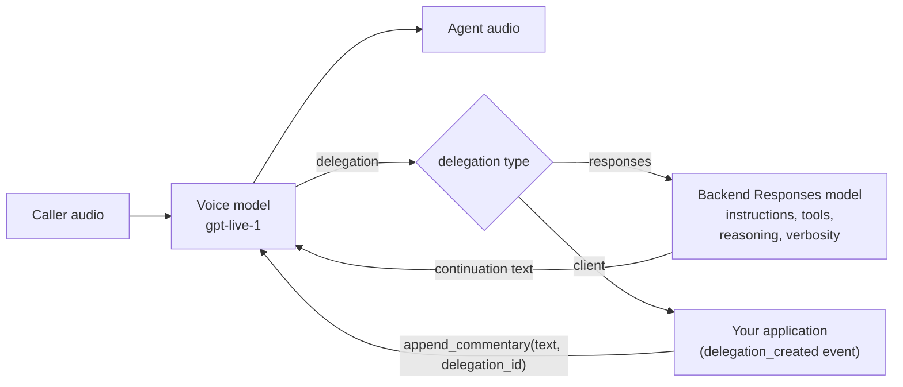

# GPT-Live primer

A practical guide to OpenAI **GPT-Live** (`gpt-live-1`) as used from **LiveKit Agents 1.8**
(`livekit-plugins-openai` 1.8.3). Every API named here is taken from the installed plugin source:

- `livekit/plugins/openai/realtime/gpt_live_model.py` (`GPTLiveModel`, `GPTLiveSession`,
  `ResponsesDelegationOptions`, `GPTLiveDelegation`)
- `livekit/plugins/openai/realtime/gpt_live_types.py` (wire protocol types)
- `livekit/agents/llm/duplex.py` and `duplex_adapter.py` (the framework's `DuplexModel` contract)

Where the source doesn't settle something (pricing, service-side limits), this page says so.

> Related: [`voice-agent-architectures.md`](voice-agent-architectures.md) (where GPT-Live sits
> among the alternatives), [`why-livekit.md`](why-livekit.md), [`architecture.md`](architecture.md),
> [`modular-prompts.md`](modular-prompts.md), [`tools.md`](tools.md), [`evals.md`](evals.md).

---

## 1. What GPT-Live is

GPT-Live is a **full-duplex speech-to-speech model** with a built-in **delegation** mechanism:

- A **voice model** listens and speaks *at the same time*, over one WebSocket. It owns the
  conversation: when to speak, when to yield, when to acknowledge, how to handle interruptions.
- When it needs to think or act, it **delegates** to a **backend** you configure (by default a
  Responses model, `gpt-5.6-luna`), which runs reasoning and tools. The voice model speaks the
  result in its own words, and can keep the caller company while the backend works.



### Full-duplex vs half-duplex

| | Half-duplex realtime (e.g. `gpt-realtime`) | Full-duplex (GPT-Live) |
|---|---|---|
| Turn model | Take turns; the user's speech during playback is a barge-in signal. | Both sides can talk at once; overlap and backchannels are native. |
| Who ends a turn | Server VAD / semantic VAD, or your own VAD + turn detector. | The model. No VAD, STT, turn detector, or TTS to configure. |
| Client control | `response.create`, `response.cancel`, `conversation.item.truncate`. | **None of these exist.** No client event creates, cancels, or truncates a response. |
| Reasoning/tools | Same model that speaks. | Delegated to a separate backend. |
| Mid-session instructions | Mutable (`session.update`). | **Immutable**; only ≤500-token appends. |

In LiveKit terms: GPT-Live is an `llm.DuplexModel` ("a speech model that listens and speaks at the
same time, handling interruptions itself"). `AgentSession` wraps it in a `DuplexRealtimeAdapter`
automatically. The adapter's `interrupt()`, `truncate()`, `commit_audio()` and `clear_audio()` are
deliberate no-ops ("barge-in is the model's own, and it cannot be cancelled").

### Server-driven turn-taking, and how you still nudge it

You can't force the model to speak or stop, but you can influence it:

- `session.generate_reply(instructions=...)` works: the plugin turns it into an
  `append_commentary` ask that ends "Do not wait for the caller to speak first. After that, pause
  and listen." The adapter treats the next speech burst as the reply and fails the request with a
  `RealtimeError` if the model hasn't started speaking within ~10 s. Use it for greetings in
  `on_enter`.
- `append_commentary(text)`: "say this once, in your own words".
- `mute_input()` / `unmute_input()`: replace mic input with silence (e.g. while the caller is on
  hold); the model keeps generating and speaking.
- `session.say("exact text")` is **not supported** (`supports_say=False`): there is no TTS path.

---

## 2. Delegation: `responses` vs `client`

Chosen with `GPTLiveModel(delegation=...)`, **fixed for the life of the session**.

### `delegation="responses"` (default, used by this repo)

Delegated work runs on a backend **Responses** model. The plugin builds its config from
`ResponsesDelegationOptions` plus the agent's tools:

- Your `@function_tool`s (and `RawFunctionTool`s) are sent as function schemas. When the backend
  calls one, the plugin emits a normal `function_call`; LiveKit runs your tool; the plugin sends
  the output back (`response.item.create`) and, once *every* open call has an answer, issues one
  `response.create` to continue. The voice model speaks the continuation on its own
  (`auto_tool_reply_generation=True`).
- **OpenAI provider tools** (`OpenAITool` subclasses such as `WebSearch`, `FileSearch`,
  `CodeInterpreter`) are passed through as-is and **execute server-side** on the backend.
- **Tools are mutable** mid-session (`mutable_tools=True`): the plugin sends a sparse
  `session.update` with the new backend tool list.
- A tool result with `reply_required=False` is still answered: the plugin logs a warning because
  the backend cannot close a call without a spoken continuation.
- Backend token usage is reported as `LLMMetrics` (under the backend model's name) on
  `metrics_collected`.

#### `ResponsesDelegationOptions`

A `TypedDict`; unset keys are not sent and the service default applies.

| Key | Meaning |
|---|---|
| `model` | Responses model slug; `gpt-5.6-luna` when unset. On Azure, a Responses **deployment** name in the same resource (required there). |
| `instructions` | Backend instructions, **distinct from** the voice model's instructions. |
| `tool_choice` | `"auto"`, `"required"`, `"none"`, or a specific function. Framework-level `tool_choice` changes are forwarded to the backend mid-session. |
| `parallel_tool_calls` | Allow several calls per backend response. |
| `reasoning` | Responses reasoning config, e.g. `{"effort": "low"}`. |
| `text` | Responses text config, e.g. `{"verbosity": "low"}`. |
| `service_tier` | Service tier for backend requests. |
| `max_output_tokens` | Cap per backend response (at least 16). |

### `delegation="client"`

The service hands delegated work to **your application**:

- The plugin emits `delegation_created` with a `GPTLiveDelegation(id, pending_transcript)`. It
  carries no task text: the ask is the conversation itself (the agent's chat context), plus
  `pending_transcript`, the caller's current turn that hasn't landed in the chat context yet.
- You answer with `append_commentary(text, delegation_id=d.id)`; repeated calls with the same id
  continue that work.
- **Framework tools are not allowed.** If the agent has any tools, the plugin raises
  `RealtimeError` ("client delegation has no tool channel"). `mutable_tools` is `False`.
- Answering is manual today (the plugin has a TODO to route tool outputs automatically).

Use it when the "brain" is not an OpenAI Responses model: your own orchestrator, another vendor's
LLM, a rules engine, or a RAG service you already operate.

---

## 3. The three append channels

Reached through `agent.duplex_session` (returns the `GPTLiveSession`). Each takes
`text` and an optional `delegation_id`, returns immediately, and is **capped at 500 tokens**
(enforced by the service, not the plugin).

| Method | Wire event | Semantics | Typical use |
|---|---|---|---|
| `append_instructions(text)` | `session.instructions.append` | A **standing rule** added to the voice instructions. | "The caller prefers to be addressed as Dr. Lee." |
| `append_thinking(text)` | `session.thinking.append` | Something to **know without saying**. | CRM facts, the result of a background check, UI state. |
| `append_commentary(text)` | `session.commentary.append` | Something to **say once**, in its own words. | Proactive notices; answering a client delegation. |

The plugin also uses them itself: system/developer messages inserted into the chat context become
`append_instructions`; other new chat items become `append_thinking`.

---

## 4. Capabilities: what can change after start

From `GPTLiveModel.__init__` (`llm.DuplexCapabilities`):

| Capability | Value | Consequence |
|---|---|---|
| `user_transcription` | `True` | You get user transcripts from the model itself (no STT). |
| `auto_tool_reply_generation` | `True` | The model continues speaking once tool results reach the backend. |
| `mutable_instructions` | **`False`** | Changing `Agent.instructions` after `session.start` raises `RealtimeError`. Use `append_instructions`. |
| `mutable_chat_context` | **`False`** | You cannot rewrite history; new items are *appended* as thinking/instructions. |
| `mutable_tools` | `delegation == "responses"` | Tools can be updated under responses delegation, never under client. |

Also immutable after start: **voice**, **delegation type**, **model**. Backend
`tool_choice` and tools can change via sparse `session.update`.

Handoffs: when LiveKit hands off to an agent with different instructions, it cannot reuse the
duplex session (instructions aren't mutable), so it opens a **new** GPT-Live session with the new
instructions, seeded from history (subject to the caps below).

This is why this repo composes the full voice and backend prompts **once, up front, per session**
from versioned modules. See [`modular-prompts.md`](modular-prompts.md).

---

## 5. Protocol, audio, voices

| | |
|---|---|
| Endpoint | WebSocket `wss://api.openai.com/v1/live/sessions` (derived from `base_url` / `OPENAI_BASE_URL`). |
| Auth | `Authorization: Bearer $OPENAI_API_KEY`. |
| Audio | 24 kHz, mono, 16-bit PCM (`audio/pcm`, rate 24000). The plugin resamples input automatically and sends 100 ms chunks. The wire types also define `audio/pcmu` / `audio/pcma`, but the plugin always uses PCM. |
| Startup | One `session.start` carries the whole config: `model`, `instructions`, startup `input` history, `audio` (format + voice), and `delegation`. |
| Voices | `aster`, `beacon`, `cinder`, `marin` (default), `stone`, `vesper`; another supported name; or `{"id": "voice_..."}` for an authorized custom voice. |
| Usage | `session.usage.updated` reports cumulative voice usage **in seconds** (plus a context-window usage ratio); the plugin emits per-event deltas as `RealtimeModelMetrics.session_duration`. |
| Close reasons | `close_requested`, `expired`, `content`, `remote_hangup`, `connection_lost`. |
| Debugging | `openai_server_event_received` and `openai_client_event_queued` events on the session; `LK_OPENAI_DEBUG=1` logs non-audio client events. |

### Service tier

`GPTLiveModel(service_tier=...)` sends the `OpenAI-Service-Tier` header on the WebSocket
connection. The plugin's type allows `auto`, `default`, `flex`, `priority`, `ultrafast`. Unset
leaves the header off and your account default applies. Which tiers are available for GPT-Live
and how they're priced is account- and time-dependent; check your OpenAI dashboard. The backend
has its own `responses_options["service_tier"]`.

### Azure OpenAI

```python
from livekit.plugins.openai.realtime import GPTLiveModel

model = GPTLiveModel.with_azure(
    azure_deployment="gpt-live-1",  # voice model deployment
    azure_endpoint="https://<resource>.openai.azure.com",  # or AZURE_OPENAI_ENDPOINT
    api_key="<api-key>",  # or AZURE_OPENAI_API_KEY, or entra_token=
    responses_options={"model": "<responses-deployment>"},  # required with responses delegation
)
```

The plugin connects to `/openai/v1/live/sessions` on the resource, sends the key as an `api-key`
header (or `Authorization: Bearer <entra_token>`), and refuses to start `responses` delegation
without a backend deployment name, because the OpenAI default model name means nothing on Azure.

### Reconnects and session recycling

- On a retryable error the plugin reconnects with backoff (`conn_options`), emits
  `session_reconnected`, and sends a **fresh `session.start`** reseeded from its own history of
  everything said (both sides, plus narrated tool calls/results).
- Startup history is **capped**: the plugin keeps the **newest 128 items** and drops older ones
  with a warning; the service additionally caps startup history at **8192 tokens**.
- In-flight backend responses and open tool calls on the dropped connection are discarded.
- Fatal errors (`insufficient_quota`, `invalid_api_key`, `account_deactivated`,
  `billing_hard_limit_reached`) are not retried.
- `max_session_duration=<seconds>` proactively recycles the connection through the same reseed
  path. Useful for bounding cost and context growth, but each recycle loses history beyond the caps.

### Pricing

Two meters:

1. **Voice session**, billed by time. The protocol reports usage in seconds. At time of writing,
   OpenAI's public pricing is on the order of **$0.05 per minute, billed per second**; confirm
   on OpenAI's pricing page before budgeting.
2. **Backend Responses model** tokens (including reasoning tokens) and **tool fees** (e.g. web
   search), billed separately at that model's rates.

Levers: `reasoning.effort`, `text.verbosity`, `max_output_tokens`, the backend model choice,
`search_context_size` on `WebSearch`, and ending idle sessions.

### Testing constraints

A `DuplexModel` "speaks only through audio", so LiveKit's **text simulation** mode refuses to run
it (`RuntimeError`, pointing you to `lk agent simulate audio`). End-to-end tests need audio. This
repo therefore tests the backend brain as text via the Responses API and reserves full voice evals
for changes that affect voice behavior. See [`evals.md`](evals.md).

---

## 6. How to use GPT-Live in your own voice agent

Install `livekit-agents[openai]~=1.8` and set `OPENAI_API_KEY` plus your `LIVEKIT_*` credentials.
See [`getting-started.md`](getting-started.md) for running this repo.

### 6.1 Minimal agent

```python
from livekit import agents
from livekit.agents import Agent, AgentServer, AgentSession
from livekit.plugins.openai.realtime import GPTLiveModel

server = AgentServer()


@server.rtc_session()
async def entrypoint(ctx: agents.JobContext) -> None:
    session = AgentSession(
        llm=GPTLiveModel(
            model="gpt-live-1",
            voice="marin",
            responses_options={
                "instructions": "Answer precisely. Keep results short; the voice model will phrase them.",
                "reasoning": {"effort": "low"},
                "text": {"verbosity": "low"},
            },
        ),
    )
    await session.start(
        room=ctx.room,
        agent=Agent(instructions="You are Ava, a warm, concise voice assistant."),
    )
    # the plugin turns this into an append_commentary "speak now" ask
    await session.generate_reply(instructions="Greet the caller briefly.")


if __name__ == "__main__":
    # works in 1.8.3 but warns: the rich Python CLI is being replaced by `lk agent ...`
    agents.cli.run_app(server)
```

No `vad=`, `stt=`, `tts=`, or `turn_detection=`: GPT-Live does all of it. `Agent(instructions=...)`
becomes the **voice** instructions (immutable once started); `responses_options["instructions"]`
are the **backend** instructions.

### 6.2 Adding tools

Function tools and OpenAI provider tools go on the `Agent` as usual. Under
`delegation="responses"` they run on the backend model.

```python
from livekit.agents import Agent, RunContext, function_tool
from livekit.plugins.openai.tools import WebSearch


@function_tool
async def check_restaurant_availability(
    context: RunContext,
    restaurant: str,
    date: str,
    time: str,
    party_size: int,
) -> str:
    """Check open tables. Never books.

    Args:
        restaurant: Restaurant name.
        date: ISO date, YYYY-MM-DD.
        time: 24h time, HH:MM.
        party_size: Number of guests.
    """
    ...  # call your provider; return a compact result


agent = Agent(
    instructions="You are Ava, a dining concierge. ...",
    tools=[
        check_restaurant_availability,
        WebSearch(search_context_size="low"),  # executes server-side on the backend model
    ],
)
```

Keep tool outputs compact: they flow into backend context and into history that is reseeded (and
capped) on reconnects and handoffs. This repo's tools live behind a registry; see
[`tools.md`](tools.md).

### 6.3 Steering mid-session with the append channels

```python
from livekit.agents import Agent, RunContext, function_tool
from livekit.plugins.openai.realtime import GPTLiveSession


class Concierge(Agent):
    @function_tool
    async def remember_preference(self, context: RunContext, preference: str) -> str:
        """Record a lasting caller preference (e.g. dietary needs)."""
        live: GPTLiveSession = self.duplex_session  # type: ignore[assignment]
        live.append_instructions(f"Caller preference, apply for the rest of the call: {preference}")
        return "noted"

    async def on_enter(self) -> None:
        live: GPTLiveSession = self.duplex_session  # type: ignore[assignment]
        live.append_thinking(
            "Caller is signed in as a returning guest named Sam."
        )  # know, don't say
        self.session.generate_reply(instructions="Welcome Sam back.")
```

`duplex_session` raises `RuntimeError` if the agent isn't running or isn't on a `DuplexModel`.
Mind the 500-token cap per append.

### 6.4 Client delegation: bring your own brain

```python
import asyncio

from livekit.agents import Agent
from livekit.plugins.openai.realtime import GPTLiveDelegation, GPTLiveModel, GPTLiveSession

model = GPTLiveModel(delegation="client")  # no backend Responses model; the app answers


class ClientDelegatedAgent(Agent):
    def __init__(self) -> None:
        # tools must be empty: client delegation raises RealtimeError if any are set
        super().__init__(instructions="You are Ava. Delegate factual questions.")
        self._tasks: set[asyncio.Task] = set()

    async def on_enter(self) -> None:
        live: GPTLiveSession = self.duplex_session  # type: ignore[assignment]

        def on_delegation(d: GPTLiveDelegation) -> None:
            task = asyncio.create_task(self._answer(live, d))
            self._tasks.add(task)
            task.add_done_callback(self._tasks.discard)

        live.on("delegation_created", on_delegation)

    async def _answer(self, live: GPTLiveSession, d: GPTLiveDelegation) -> None:
        # the ask is the conversation so far plus the caller's in-progress turn
        history = self.chat_ctx.items
        answer = await my_brain.answer(history, d.pending_transcript)  # your system
        live.append_commentary(answer, delegation_id=d.id)  # ≤500 tokens; repeat to continue
```

Pass `llm=model` to `AgentSession` as in 6.1.

### 6.5 Checklist before production

- [ ] Voice instructions complete and reviewed **before** start (they can't change).
- [ ] Voice vs backend instructions separated: *how to talk* vs *how to decide*.
- [ ] Backend `reasoning.effort` and `text.verbosity` set deliberately; `max_output_tokens` bounded.
- [ ] Tool outputs compact; tools idempotent/read-only where possible.
- [ ] Watch `metrics_collected` for voice seconds and backend tokens; alert on cost.
- [ ] Handle `error` / `session_reconnected`; decide on `max_session_duration`.
- [ ] Audio-level evals for voice changes; text evals for backend changes ([`evals.md`](evals.md)).
