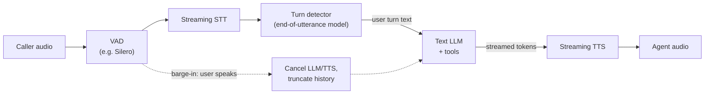
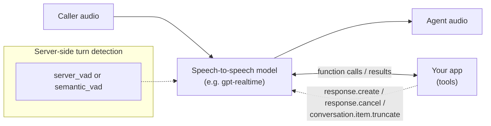
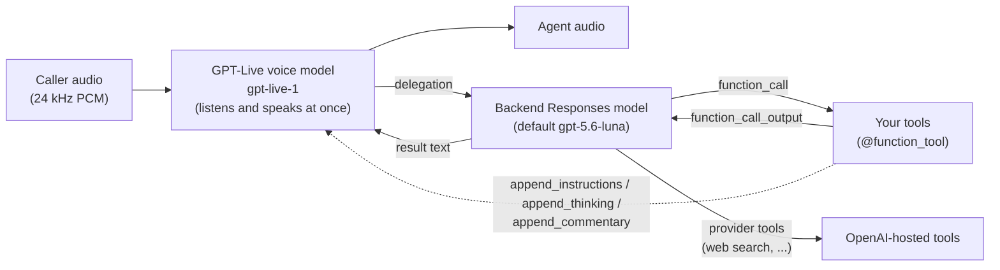
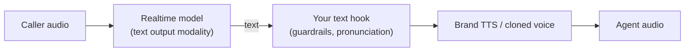
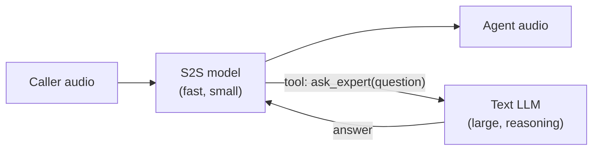
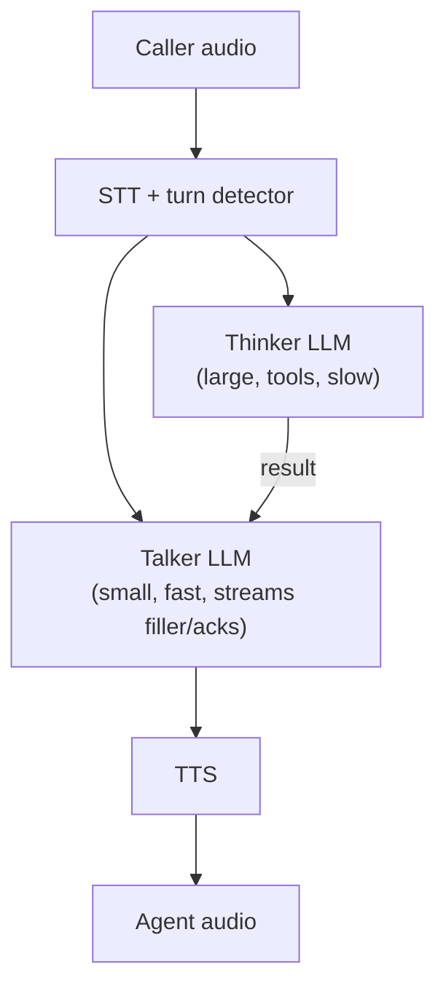
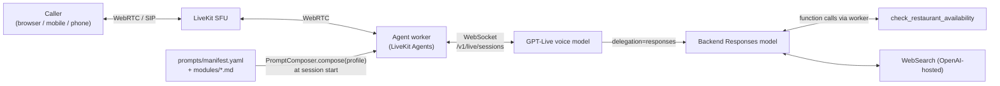

# Voice agent architectures: what we could have built, and what we did

This document surveys the realistic ways to build a conversational voice agent in 2026, and then
explains the choice this repo makes: **OpenAI GPT-Live (`gpt-live-1`) as a full-duplex voice model,
delegating reasoning and tools to a backend Responses model, hosted inside LiveKit Agents, with
prompts composed from versioned modules once per session.**

It is written for an engineer deciding what to build. Every architecture here is a legitimate
choice for some product; the aim is to make the trade-offs explicit rather than to sell one.

> Related docs: [`architecture.md`](architecture.md) (this repo's system design),
> [`gpt-live-primer.md`](gpt-live-primer.md) (GPT-Live in depth),
> [`why-livekit.md`](why-livekit.md), [`modular-prompts.md`](modular-prompts.md),
> [`tools.md`](tools.md), [`evals.md`](evals.md), [`getting-started.md`](getting-started.md).

A note on numbers: latency and cost figures below are **order-of-magnitude guides**, not
benchmarks. They move with every model release, region, and pricing change. Measure your own
stack and check current provider pricing before committing.

---

## Contents

1. [The axes that actually matter](#1-the-axes-that-actually-matter)
2. [Cascaded pipeline (VAD → STT → LLM → TTS)](#2-cascaded-pipeline-vad--stt--llm--tts)
3. [Half-duplex speech-to-speech (Realtime API style)](#3-half-duplex-speech-to-speech-realtime-api-style)
4. [Full-duplex speech-to-speech with delegation (GPT-Live)](#4-full-duplex-speech-to-speech-with-delegation-gpt-live)
5. [Hybrid variants](#5-hybrid-variants)
6. [Transport choices](#6-transport-choices)
7. [Orchestration and hosting](#7-orchestration-and-hosting)
8. [What this repo chose and why](#8-what-this-repo-chose-and-why)
9. [When you should NOT use this architecture](#9-when-you-should-not-use-this-architecture)

---

## 1. The axes that actually matter

Before comparing boxes-and-arrows, fix the questions you are answering:

| Axis | Question |
|---|---|
| **Responsiveness** | How long from the caller finishing (or pausing) to the agent's first audible sound? Does it handle backchannels ("mm-hm"), interruptions, and overlapping speech gracefully? |
| **Intelligence** | How good is the reasoning and tool use, and can you pick the reasoning model independently of the voice? |
| **Control** | Can you inspect and rewrite the text before it is spoken? Choose the exact voice? Decide exactly when the agent speaks? |
| **Observability** | Do you get transcripts, per-stage timings, tool traces, and something you can evaluate in CI? |
| **Cost** | Per-minute vs per-token, how it scales with talk time vs think time. |
| **Coupling** | How many vendors, and how hard is it to swap one out? |
| **Transport** | How audio gets from the caller to the model and back over real networks (Wi-Fi, 4G, PSTN). |

No architecture wins every row. The main split is between **pipelines you assemble** (maximum
control, you own the turn-taking problem) and **speech-native models** (better conversational feel,
you give up some control to the model).

---

## 2. Cascaded pipeline (VAD → STT → LLM → TTS)

The classic design: every stage is a separate model, glued together with text.

### How it works

1. **VAD** (voice activity detection, e.g. Silero) flags when someone is speaking.
2. **STT** streams partial and final transcripts.
3. A **turn detector** decides whether the user has finished. Plain silence timeouts
   (e.g. "500 ms of silence = end of turn") are fast but interrupt people who pause mid-thought;
   semantic end-of-utterance models (LiveKit ships transformer-based turn-detector models; other
   frameworks have equivalents) look at the transcript to tell "I'd like a table for…" from
   "I'd like a table for four." — trading a little latency for far fewer false cut-ins.
4. The **LLM** gets the full text history plus tools and streams a reply.
5. **TTS** starts synthesizing on the first sentence fragment and streams audio out.
6. **Barge-in**: when VAD fires during playback, the framework stops TTS, cancels generation, and
   truncates the assistant message in history to what was actually heard.

### Advantages

- **Maximum control.** Every hop is text you can log, filter, redact, or rewrite. You can
  pronunciation-correct before TTS, enforce output guardrails, and swap any stage independently.
- **Best-of-breed per stage.** Pick the STT that handles your accents and domain vocabulary, the
  LLM with the best tool use, the TTS voice your brand wants (including cloned voices).
- **Text-native evals.** The LLM step is just a chat completion: you can unit-test it cheaply
  without any audio at all.
- **Any LLM**, including self-hosted or fine-tuned ones.

### Drawbacks

- **Latency stacks.** End-of-turn delay + STT finalization + LLM time-to-first-token + TTS
  time-to-first-byte. Well-tuned pipelines hit roughly 600 ms–1.2 s voice-to-voice; naive ones
  sit at 2 s+.
- **Turn-taking is your problem.** Silence thresholds, semantic turn detection, false barge-ins
  from coughs and "uh-huh", echo on speakerphones: all yours to tune.
- **Paralinguistics are lost.** Tone, hesitation, laughter, and emphasis become flat text. The LLM
  cannot hear that the caller is annoyed; TTS prosody is guessed from text.
- **Strictly half-duplex.** The agent either talks or listens; backchannels and overlap are
  approximated with interruption heuristics.
- **Three or four vendors** to contract, monitor, and keep in sync.

| Profile | Summary |
|---|---|
| Latency | Sum of stages; ~0.6–1.2 s tuned, worse when the LLM calls tools. |
| Cost | Per-token LLM + per-minute/per-character STT and TTS; often the cheapest per minute with small models, and very predictable. |
| Control/observability | Excellent: text at every boundary, per-stage metrics. |
| Choose when | You need strict output control (regulated scripts, compliance), a specific voice or language pair a speech model lacks, a self-hosted LLM, or the cheapest possible minute. |

---

## 3. Half-duplex speech-to-speech (Realtime API style)

One multimodal model takes audio in and produces audio out. OpenAI's Realtime API
(`gpt-realtime` family) is the reference example.

### How it works

- Audio streams to the model over a persistent connection (WebRTC or WebSocket).
- **Turn detection** runs server-side (`server_vad` on silence or `semantic_vad` on meaning;
  the LiveKit OpenAI plugin defaults to `semantic_vad` with medium eagerness) or you disable it
  and drive turns yourself with local VAD / a turn detector.
- The protocol is **turn-based and client-steerable**: the client can `response.create` to make
  the model speak, `response.cancel` to stop it, and `conversation.item.truncate` to trim what it
  "said" to what the user actually heard before an interruption.
- Tools are standard function calls: the model emits a call, your app runs it, sends the result,
  and triggers the next response.

### Advantages

- **Lower latency and better prosody** than most cascades: no STT/TTS hops, and the model hears
  tone and emphasis.
- **Single vendor, single connection.**
- **Still steerable.** You can cancel, truncate, inject items, update instructions and tools
  mid-session, and choose exactly when the model speaks. Frameworks can combine it with their own
  VAD/turn detector, or with a separate TTS (see hybrids).

### Drawbacks

- **Still half-duplex.** It takes turns: while it speaks, user audio is primarily a barge-in
  signal. No true backchanneling or overlap handling.
- **One model does everything.** The same model must sound natural *and* reason *and* call tools.
  You cannot pair a small fast voice with a large careful reasoner without building it yourself.
- **Less text control.** There is no text step before audio to rewrite; you get a transcript of
  what was said after the fact.
- **Per-token audio pricing** that grows with context length; long sessions get expensive unless
  you manage history.

| Profile | Summary |
|---|---|
| Latency | Typically sub-second voice-to-voice; tool calls add a full round-trip. |
| Cost | Audio input/output tokens (and cached input). Grows with conversation length. |
| Control/observability | Good: rich event stream, client-driven turn control, but no pre-speech text hook. |
| Choose when | You want a natural voice with moderate reasoning needs and want to keep fine-grained control over when the model speaks. |

---

## 4. Full-duplex speech-to-speech with delegation (GPT-Live)

GPT-Live splits the agent into **two brains**: a full-duplex **voice model** that owns the
conversation, and a **backend Responses model** that it delegates reasoning and tools to.

### How it works

- The voice model **listens and speaks at the same time**. It decides when to talk, when to
  yield, when to acknowledge, and when to keep going. There is **no client event that creates,
  cancels, or truncates a response**; turn-taking is entirely server-driven. In LiveKit's adapter,
  `interrupt()` and `truncate()` are deliberate no-ops for this reason.
- When the conversation needs thinking or tools, the voice model **delegates**. It can keep
  talking naturally ("let me check that for you") while the work runs:
  - `delegation="responses"` (default): delegated work runs on a backend **Responses** model you
    configure (model, instructions, reasoning effort, verbosity, tool choice, service tier, max
    output tokens). Your `@function_tool`s and OpenAI provider tools (e.g. `WebSearch`) run there;
    results flow back and the voice model speaks the continuation on its own.
  - `delegation="client"`: the service hands the work to your app as a `delegation_created`
    event; you answer with `append_commentary(text, delegation_id=...)`. Useful if the "brain" is
    your own system (another vendor's LLM, a rules engine, a RAG service).
- Mid-session, the app can steer the voice model with three small append channels (each capped
  at 500 tokens): a standing rule (`append_instructions`), silent context (`append_thinking`), or
  something to say once in its own words (`append_commentary`).

See [`gpt-live-primer.md`](gpt-live-primer.md) for the full API.

### Advantages

- **The most natural conversational feel available off the shelf**: true overlap, backchannels,
  graceful interruptions, and filler while tools run, without you tuning a single VAD threshold.
- **Voice and intelligence are decoupled.** Reasoning quality is set by the backend model and its
  `reasoning.effort`, independent of the voice. You can raise effort for a hard domain without
  touching latency of small talk.
- **Tool latency is hidden.** The voice keeps the caller company while the backend works, instead
  of dead air during a function call.
- **Much less plumbing.** No VAD, STT, turn detector, or TTS to configure.
- **Two instruction surfaces** map cleanly onto two concerns: how to *talk* vs how to *decide*.

### Drawbacks

- **Least control over turn-taking.** You cannot force a cut-off, cancel a reply, or truncate.
  You can nudge (`append_commentary`, `mute_input`) but the model decides.
- **Voice instructions are immutable after session start.** Changing them raises
  `RealtimeError`; you only get ≤500-token appends. Agent handoffs that change instructions start
  a fresh GPT-Live session reseeded from history.
- **Startup history is capped** (the service caps it at 8192 tokens; the plugin also keeps at most
  the newest 128 items, dropping older ones with a warning). Long conversations lose detail across
  reconnects and handoffs.
- **No pre-speech text hook.** You cannot rewrite what the voice will say; `session.say()` is not
  supported (the adapter reports `supports_say=False`).
- **Audio-only runtime.** A `DuplexModel` cannot run under LiveKit's text simulation mode, so
  end-to-end evals need real audio (or the cheaper backend-only evals this repo adds).
- **Vendor coupling.** Voice, backend, and hosted tools are all OpenAI (or Azure OpenAI).
- **Two meters running**: per-minute voice session pricing plus backend tokens and tool calls.
- **Newer API surface.** Fewer production war stories; expect behavior and defaults to move.

| Profile | Summary |
|---|---|
| Latency | Conversational latency is the model's own and typically feels instant, including overlap; *answer* latency on tool turns is backend reasoning + tools, but it is masked by natural filler. |
| Cost | Voice session billed by time (at time of writing, public pricing is on the order of cents per minute, billed per second; check current pricing) **plus** backend Responses tokens and tool fees. Per-minute cost is predictable; backend cost scales with how often it delegates and at what reasoning effort. |
| Control/observability | Transcripts for both sides, backend function calls, usage events, and raw server events (`openai_server_event_received`). No control over *when* it speaks. |
| Choose when | Conversational quality is the product (concierge, support, companionship, coaching), tool use is essential, and you can live with immutable voice instructions per session. |

---

## 5. Hybrid variants

Real systems often mix the above. The three common hybrids:

### 5a. Realtime model for understanding + separate TTS for output

The speech model listens (keeping paralinguistic understanding) but emits text; your own TTS
speaks. In LiveKit Agents this is `openai.realtime.RealtimeModel(modalities=["text"])` plus a
`tts=` on the `AgentSession`.

- **Pros:** exact brand voice; a text hook before speech; keeps speech-native understanding.
- **Cons:** you reintroduce TTS latency and lose the model's own prosody; still half-duplex.
- **Not possible with GPT-Live:** it only speaks through its own audio.

### 5b. Speech-to-speech front end + text-only LLM for tools

A realtime model with a single "ask the expert" tool that calls a stronger text model (optionally
with its own tools). Hand-rolled delegation.

- **Pros:** works with any S2S vendor and any text LLM; you control the expert's prompts and tools.
- **Cons:** the voice model sits silent or improvises while the tool runs; you own timeouts,
  cancellation, and "what did the expert say" context stitching.
- **Relation to GPT-Live:** this is exactly what `delegation="responses"` productizes, and what
  `delegation="client"` lets you keep doing with GPT-Live as the front end.

### 5c. Hand-built "thinker / talker" split

A cascaded pipeline with two LLMs: a fast one that keeps talking and a slow one that thinks, with
an orchestrator deciding who speaks.

- **Pros:** full control, any models, text at every hop.
- **Cons:** significant engineering (arbitration, race conditions, context sharing); still
  half-duplex; latency floor of STT + TTS.
- **When:** you need the GPT-Live-style experience but cannot use OpenAI, or need text-level
  control over every word.

---

## 6. Transport choices

Independent of the model architecture: how does audio move?

```mermaid
flowchart TB
    subgraph A["A. Browser direct to provider (WebRTC)"]
      B1["Browser"] <-->|"WebRTC"| P1["Provider"]
      B1 -.-|"ephemeral key from<br/>your token server"| S1["Your server"]
    end
    subgraph B["B. Server WebSocket to provider"]
      B2["Client"] <-->|"your transport"| S2["Your server"]
      S2 <-->|"WebSocket"| P2["Provider"]
    end
    subgraph C["C. Media server (LiveKit SFU)"]
      B3["Client"] <-->|"WebRTC"| SFU["LiveKit SFU"]
      SFU <-->|"WebRTC"| W3["Agent worker"]
      W3 <-->|"WebSocket"| P3["Provider"]
    end
    subgraph D["D. Telephony"]
      Phone["PSTN caller"] <--> SIP["SIP trunk"]
      SIP <--> SFU2["SIP bridge / media server"]
      SFU2 <--> W4["Agent worker"]
    end
```

| Option | Pros | Cons | Fits |
|---|---|---|---|
| **A. Browser → provider over WebRTC** | Fewest hops; lowest infra; good jitter handling on the last mile. | Tools and secrets must go through a side channel to your server; weak server-side observability, recording, and control; browser-only; ties the client to one provider's protocol. GPT-Live in this plugin is a server-side WebSocket, so this path does not apply to it here. | Prototypes, single-user demos. |
| **B. Server WebSocket to provider** | Simple; server holds secrets and tools; one hop to the model. | You still need a client transport. Raw WebSocket (TCP) over the public internet suffers head-of-line blocking under packet loss, so the *client* leg should not be a WebSocket for real-world mobile users. | Server-to-server, or behind a media layer. |
| **C. Media server (SFU) + agent worker** | WebRTC to the user (UDP, jitter buffers, FEC/Opus, adaptive bitrate, TURN fallback); agent runs next to the provider in a datacenter; multi-participant rooms, recording, and telephony share one model. | Another piece of infrastructure (or a cloud vendor); one extra media hop. | Production apps across web, mobile, and phone. **This repo.** |
| **D. Telephony / SIP** | Reaches every phone; call transfer, DTMF. | 8 kHz narrowband audio, PSTN latency, carrier costs, and a new class of problems (answering machines, IVRs). | Contact centers, outbound calling. Usually combined with C. |

The key insight is that the provider leg (B) is datacenter-to-datacenter and is fine as a
WebSocket, while the user leg crosses Wi-Fi and cellular and wants WebRTC. Option C gives you both.
Details in [`why-livekit.md`](why-livekit.md).

---

## 7. Orchestration and hosting

Who runs the loop that connects transport, models, tools, and state?

| Option | What you get | What you give up |
|---|---|---|
| **Raw provider SDK** (OpenAI SDK + your own server) | No abstraction lag; every new provider feature on day one; minimal dependencies. | You build transport, reconnection, session lifecycle, tool execution, transcripts, metrics, recording, worker scaling, and testing harnesses yourself. Easy to prototype, expensive to productionize. |
| **Open-source framework: LiveKit Agents** | `AgentSession`, `Agent`, `@function_tool`, handoffs/tasks, pluggable STT/LLM/TTS/realtime/duplex models, worker dispatch and load balancing, WebRTC/SIP transport, test and judge helpers, metrics/OTel. Self-host or LiveKit Cloud. | Learning curve; framework abstractions may trail brand-new provider features; you are coupled to LiveKit's transport. |
| **Open-source framework: Pipecat** | Flexible frame-pipeline model, very broad provider coverage, transport-agnostic (Daily, raw WebRTC, WebSocket, telephony). | You still choose and operate the transport; different abstraction style (frame processors) that some teams find more flexible, others more low-level. |
| **Hosted voice platforms** (Vapi / Retell-style) | Fastest to a working phone agent; dashboards, telephony, analytics included; configure more than code. | Per-minute platform margin on top of model costs; less control over pipeline internals and data residency; harder to version prompts/evals in git; new model types arrive when the platform adds them. |

Rule of thumb: raw SDK for a spike, hosted platform for a phone agent you need next week with no
engineering team, framework when voice is a core product surface you will iterate on for years.

---

## 8. What this repo chose and why

**Stack:** GPT-Live (`gpt-live-1`) full-duplex voice model → `delegation="responses"` to a backend
Responses model (`gpt-5.6-luna` by default, low reasoning effort, low verbosity) → tools
(`WebSearch` provider tool + `check_restaurant_availability` function tool) → hosted in
**LiveKit Agents 1.8** (`AgentSession(llm=GPTLiveModel(...))`) over LiveKit WebRTC → prompts
composed from versioned modules into a `PromptBundle` **once per session**.

### Why each piece

- **GPT-Live over a cascade:** a dining concierge is a *conversation*. People think aloud ("uh,
  maybe Saturday… no, Friday"), interrupt, and talk over the agent. A full-duplex model handles
  that natively; a cascade would need a turn-detection tuning project to get close.
- **GPT-Live over half-duplex realtime:** tool calls (availability lookups, web searches) take
  seconds. Delegation lets the voice keep the caller company during that time, and lets us pick
  the reasoning model and effort independently.
- **`responses` delegation over `client`:** our tools are ordinary `@function_tool`s and an
  OpenAI provider tool. `responses` keeps LiveKit's tool machinery working unchanged, lets tools
  be updated mid-session, and lets the backend run OpenAI-hosted web search server-side.
  `client` delegation disallows framework tools entirely.
- **LiveKit Agents:** WebRTC to the user, worker dispatch, telephony, and first-class `DuplexModel`
  support with a `DuplexRealtimeAdapter`, so GPT-Live drops into `AgentSession` like any other
  model. See [`why-livekit.md`](why-livekit.md).
- **Modular prompts composed per session:** because voice instructions are **immutable after
  session start**, the full instruction set must be right *before* connecting. We compose it from
  small, reviewed modules per profile (voice vs backend targets), fingerprint the result, and use
  those fingerprints to decide which evals to run. See [`modular-prompts.md`](modular-prompts.md)
  and [`evals.md`](evals.md).

### Decision matrix

Scores are relative (●●● best) for *this* product: a conversational concierge with tools.

| Criterion | Cascaded | Half-duplex S2S | **GPT-Live + delegation** | Hand-built thinker/talker |
|---|---|---|---|---|
| Conversational naturalness (overlap, barge-in, backchannels) | ● | ●● | **●●●** | ● |
| Perceived latency on tool turns | ● | ●● | **●●●** | ●● |
| Reasoning quality independent of voice | ●●● | ● | **●●●** | ●●● |
| Fine-grained control of what/when it speaks | ●●● | ●● | **●** | ●●● |
| Mid-session prompt changes | ●●● | ●●● | **●** | ●●● |
| Plumbing / engineering effort (more ● = less effort) | ● | ●● | **●●●** | ● |
| Vendor independence | ●●● | ● | **●** | ●●● |
| Cheap, text-only CI evals | ●●● | ●● | **●● (backend only)** | ●●● |
| Cost predictability | ●●● | ●● | **●●** | ●● |

### Drawbacks we accept, and how we mitigate them

| Drawback | Why it hurts | Mitigation in this repo |
|---|---|---|
| **Voice instructions immutable after start** | No dynamic persona/prompt edits mid-call. | Compose the complete prompt per session from modules; use profiles for variants; reserve `append_instructions` / `append_thinking` for small runtime facts; handoffs start a new session. |
| **≤500-token appends** | Can't inject large context mid-call. | Put large or dynamic knowledge behind tools on the backend model, whose results aren't subject to the append cap. |
| **Startup history caps** (8192 tokens service-side, newest 128 items in the plugin) | Reconnects and handoffs lose early conversation detail. | Keep turns and tool outputs concise (low verbosity, compact tool payloads); keep essential state in tools or backend instructions rather than relying on long history. |
| **Less control over turn-taking** | Can't cancel/truncate; the model decides when to speak. | Voice-style prompt modules set expectations (brevity, confirm before acting); `mute_input()` exists for hold scenarios; evals judge interruption behavior. |
| **No pre-speech text hook** | Can't rewrite output before it is spoken. | Guardrails live in both voice and backend prompts; restaurant tool is read-only (never books); transcript-level judges in evals. |
| **Vendor coupling** | Voice, backend, and hosted tools are OpenAI. | Tools are plain Python behind a registry; `delegation="client"` or a cascaded `AgentSession` can reuse them; Azure OpenAI supported via `GPTLiveModel.with_azure`. |
| **Per-minute voice + backend tokens** | Two cost lines; long idle calls still cost minutes. | Low reasoning effort and verbosity by default; `max_output_tokens`; `max_session_duration`; monitor usage events. |
| **Audio-only evals are harder** | `DuplexModel` can't run in text simulation; audio evals are slow and costly. | Three-tier evals: free unit tests, cheap text evals of the backend brain, and full voice evals only when change-impact detection says voice behavior may have changed. See [`evals.md`](evals.md). |
| **Young API** | Defaults and behaviors may change. | Pin `livekit-agents~=1.8`, pin model slugs in config, and treat model changes as eval-triggering changes. |

---

## 9. When you should NOT use this architecture

Pick something else if:

- **You need word-exact output.** Regulated disclosures, legal scripts, medication instructions:
  use a cascade with a text hook and deterministic TTS, or at least a text-output realtime model +
  TTS.
- **You need to change the agent's instructions frequently mid-call** (dynamic persona, per-step
  scripts in a long workflow). Half-duplex realtime or a cascade handles this; GPT-Live would need
  a new session each time.
- **You need a specific TTS voice** (brand-cloned voice, a language/accent GPT-Live voices don't
  cover well). Use a cascade or realtime + TTS.
- **You cannot send audio to OpenAI or Azure OpenAI** (data residency, on-prem, air-gapped). Use
  a cascade with self-hosted STT/LLM/TTS.
- **Your calls are long and mostly idle** (hold queues, monitoring). Per-minute voice billing
  punishes that; a cascade that bills on activity may be cheaper.
- **Your traffic is dominated by PSTN** and conversational nuance matters less than cost. The
  narrowband channel erodes much of GPT-Live's advantage; benchmark a cascade first.
- **You need deterministic turn-taking** (IVR-like flows, "press or say one"). A cascade with
  explicit turn logic is simpler to reason about.
- **You want the cheapest possible CI signal on every prompt change.** Cascades let you eval the
  whole agent as text; here only the backend brain is text-testable.
