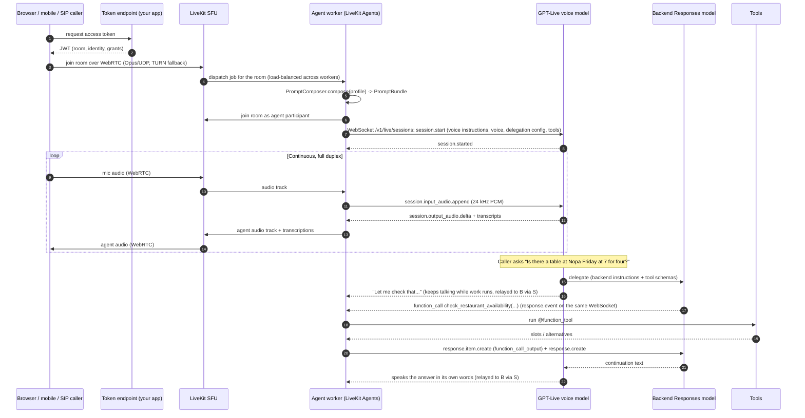

# Why LiveKit

GPT-Live is a model behind a WebSocket. A voice *product* needs much more around it: getting
audio from a phone on a train to a datacenter and back without stutter, running and scaling the
agent processes, handling phone calls, recording, metrics, and tests. This repo uses
**LiveKit** (the open-source WebRTC SFU) and **LiveKit Agents** (the Python agent framework,
v1.8.x) for all of that. This page explains why, what it costs you, and what the alternatives are.

> Related: [`voice-agent-architectures.md`](voice-agent-architectures.md) (the wider design space),
> [`gpt-live-primer.md`](gpt-live-primer.md), [`architecture.md`](architecture.md) (this repo's
> system design), [`getting-started.md`](getting-started.md).

---

## A call, end to end

The only leg that crosses the public internet from the caller is the **WebRTC** leg to the SFU.
The WebSocket to OpenAI runs from the agent worker, which you deploy in a datacenter close to the
provider.

---

## What LiveKit gives this project

### 1. WebRTC to the user instead of a raw WebSocket

A WebSocket is TCP. On a lossy mobile or Wi-Fi link, one lost packet stalls every packet behind it
(head-of-line blocking) until it is retransmitted; for real-time audio that shows up as bursts of
silence followed by sped-up catch-up, or growing latency. WebRTC media runs over UDP with:

- **Opus** with in-band FEC and packet-loss concealment, so a lost packet is a tiny glitch, not a stall;
- **adaptive jitter buffers** that smooth variable network delay;
- **congestion control / bandwidth estimation** that adapts rather than queues;
- **ICE + TURN** to get through NATs and corporate firewalls (TURN over TLS/443 as a last resort);
- **echo cancellation, noise suppression, and AGC** in browser and native client media stacks.

LiveKit is an SFU (selective forwarding unit): it forwards media between participants without
mixing, and handles reconnection and region routing (on LiveKit Cloud, a global mesh).

### 2. Agent workers, dispatch, and load balancing

LiveKit Agents runs your code as an **agent server** (`AgentServer` with an `@server.rtc_session()`
entrypoint in 1.8; the older `WorkerOptions(entrypoint_fnc=...)` still works). Workers register
with the LiveKit server, which dispatches rooms to them. The framework:

- runs each job in its own process, with **prewarmed idle processes** (`num_idle_processes`,
  `prewarm_fnc`) so a new call doesn't pay model-loading time;
- reports load (`load_fnc`) and stops accepting jobs above a threshold (`load_threshold`, 0.7 by
  default in production), so you scale horizontally by adding workers;
- drains gracefully on deploy.

You don't write a job queue, a sticky-session load balancer, or a process supervisor.

### 3. Rooms, not pipes

A call is a **room** with participants and tracks. That makes things that are painful with a
point-to-point pipe trivial: a human supervisor listening in or taking over, a second agent,
screen share or camera as input (`push_video` exists on the duplex interface; GPT-Live itself is
audio-only here), and data/text channels next to audio (transcriptions stream to the frontend).

### 4. Telephony (SIP)

LiveKit SIP bridges inbound and outbound phone calls into rooms, so the same agent answers a
browser call and a PSTN call. The framework also has answering-machine and IVR helpers
(`livekit.agents.voice.amd`, `.ivr`). This repo ships a web frontend only, but nothing in the
agent is browser-specific.

### 5. Client SDKs everywhere

Official SDKs for JavaScript/React, Swift, Kotlin, Flutter, React Native, Unity, and more, all
speaking the same room protocol. Our [`frontend/`](../frontend) is a thin React app on top of that.

### 6. Open source, self-host or Cloud

Server, SDKs, and Agents are open source (Apache 2.0). You can self-host the SFU (single binary or
Kubernetes) or use LiveKit Cloud (managed, global, with extras such as enhanced noise
cancellation and agent hosting). Moving between them is a URL and credentials change.

### 7. Framework features we actually use

| Feature | Where it shows up in this repo |
|---|---|
| `AgentSession` / `Agent` | `AgentSession(llm=GPTLiveModel(...))`; the session wraps any `DuplexModel` in `DuplexRealtimeAdapter` automatically. |
| First-class GPT-Live support | `livekit.plugins.openai.realtime.GPTLiveModel`, `ResponsesDelegationOptions`, `Agent.duplex_session` for provider-specific calls. |
| Tools | `@function_tool` for restaurant availability; `livekit.plugins.openai.tools.WebSearch` as a provider tool; both forwarded to the backend Responses model. See [`tools.md`](tools.md). |
| Handoffs / tasks | `Agent` handoffs and `AgentTask` exist for multi-stage flows. With GPT-Live, a handoff that changes instructions starts a fresh voice session (instructions are immutable), reseeded from history. |
| Testing and evals | `AgentSession.run(user_input=...)` returns a `RunResult` with `.expect` assertions and `.judge(llm, intent=...)`; `livekit.agents.evals` has `Judge`, `JudgeGroup`, `tool_use_judge`, `task_completion_judge`, and more. See [`evals.md`](evals.md). |
| Metrics and tracing | `metrics_collected` events (including GPT-Live usage), OpenTelemetry traces and metrics under `livekit.agents.telemetry`. |
| Recording | `session.start(..., record=...)` session recording and transcripts. |
| Noise cancellation | `RoomOptions` audio input accepts a noise-cancellation option (the enhanced models are a LiveKit Cloud feature). |
| Dev loop | `console` (talk to the agent in your terminal), `dev` (hot reload via `lk agent dev`), `start` (production). In 1.8 these are moving to the LiveKit CLI (`lk agent ...`); `cli.run_app` still routes them with a deprecation warning. |

---

## What it costs you

Be clear-eyed about these:

- **More infrastructure.** An SFU (or a Cloud account), a token endpoint, and a worker fleet,
  versus "one server with a WebSocket". For a prototype that is overhead.
- **Learning curve.** Rooms, participants, tracks, dispatch, job processes, `AgentSession`
  lifecycle, and the realtime/duplex adapters are real concepts to learn.
- **Another vendor if you use Cloud.** Pricing, data processing terms, and availability become a
  dependency. Self-hosting removes the vendor but adds operations work.
- **Abstraction lag.** Brand-new provider features land in the provider's API first and in the
  framework later. GPT-Live's `append_*` methods, for example, are reached through
  `agent.duplex_session` rather than the generic `AgentSession` API, and some generic APIs are
  intentionally no-ops or unsupported for a duplex model (`session.say()`, interrupt, truncate).
  The framework also has TODOs at the edges (e.g. answering a client delegation is manual).
- **An extra media hop.** Caller → SFU → worker → OpenAI instead of caller → OpenAI. In practice the
  SFU-to-worker hop is small compared with last-mile jitter it removes, but it exists.
- **Coupling to LiveKit transport.** Agents can run in console mode and other I/O, but the
  production path assumes LiveKit rooms.

---

## Alternatives

| Option | Transport | Agent runtime | Telephony | Self-host | Strengths | Weaknesses |
|---|---|---|---|---|---|---|
| **LiveKit + LiveKit Agents** (this repo) | WebRTC SFU | Python/Node framework, worker dispatch | SIP built in | Yes (OSS) or Cloud | End-to-end stack in one project; first-class `DuplexModel`/GPT-Live support; testing/eval helpers. | Extra infra; learning curve; abstraction lag. |
| **Pipecat** (+ Daily or other transport) | Pluggable (Daily WebRTC, raw WebRTC, WebSocket, telephony serializers) | Python frame-pipeline framework | Via Twilio/Telnyx/Daily etc. | Framework yes; transport depends | Very flexible pipeline model; broad provider coverage; transport-agnostic. | You assemble and operate transport and scaling yourself; GPT-Live support depends on its integration status (check before choosing). |
| **Raw OpenAI SDK + your own server** | Whatever you build (WebSocket to client is the easy, fragile default) | Your code | Build or buy | Yes | Zero abstraction lag; fewest dependencies. | You rebuild reconnection, jitter handling, dispatch, tool loop, recording, metrics, tests. |
| **Browser → OpenAI direct (WebRTC)** | Provider WebRTC | Client-side + a token server | No | N/A | Fewest hops; trivial infra for demos. | Tools and secrets need a side channel; weak server-side control and observability; browser-only; not how GPT-Live is integrated here (server-side WebSocket). |
| **Hosted voice platforms** (Vapi / Retell-style) | Managed WebRTC + phone | Platform-managed | Built in | No | Fastest to a working phone agent; dashboards included. | Per-minute platform margin; less control; prompts/evals live outside git; new model types arrive on the platform's schedule. |
| **Twilio Media Streams / CPaaS + your server** | PSTN → WebSocket | Your code | Native | Partly | Great for phone-only products with existing carrier contracts. | Narrowband audio; WebSocket leg; you build the agent runtime. |

### When LiveKit is the wrong choice

- A weekend prototype or single-user demo: go browser-direct or raw SDK.
- A phone-only product already standardized on a CPaaS with its own media streaming, and a team
  that does not want to operate or pay for another media layer.
- You need a feature the provider shipped yesterday and the framework hasn't wrapped yet, and you
  can't wait (though `duplex_session` and the raw `openai_server_event_received` /
  `openai_client_event_queued` events often give you an escape hatch).
